# HANS - Technical Architecture, Implementation, Evaluation and Handover

## Document purpose

This document is the professional technical handover for **HANS - Highly Automated Natural Language Support System**. It explains what the system does, how the main components work together, how the current tested setup was built and evaluated, and what a future maintainer needs in order to operate or extend it safely.

The document also preserves the main development stages because several important design decisions came from earlier experiments. Historical components are clearly separated from the current tested setup so they are not mistaken for active production components.

This document supports three practical uses:

1. technical handover to a future maintainer;
2. repository and code review;
3. background reference for the research and evaluation history of HANS.

### What HANS is

HANS is an AI-assisted staff-support system for handling student enquiries at HTW Berlin. It helps staff prepare responses by identifying the programme and topics in an incoming enquiry, retrieving relevant official HTW information, generating a draft response with source references, and passing that draft back to the email workflow for staff review.

The demonstrated workflow is:

`Gmail -> Apache Hop -> HANS -> evidence retrieval -> draft generation -> validation -> Apache Hop -> Gmail Draft -> staff review`

HANS is an assistant rather than an autonomous administrative system. Incoming emails are used as request context; they are not used to train or update the generation model. HANS does not make binding admission or administrative decisions. Every generated response remains a draft, and a staff member must review, edit where necessary, and manually send it.

### Implementation references

- Behavioural reference: `6dafee6`
- Backend quality checkpoint used for acceptance: `0e4219c`
- Acceptance artefact commit: `9fee966`
- End-to-end tag: `checkpoint-2026-09-25-final-e2e`
- UI/observability tag: `checkpoint-2026-09-25-final-ui-observability`
- Repository/environment hygiene after the behavioural freeze: `251fddf`

### Status vocabulary

| Label | Meaning in this document |
|---|---|
| **Baseline** | Reference HANS source/retrieval design and baseline behaviour |
| **Enhanced PoC** | Separate experimental environment used to test programme-aware, multi-topic and alternative retrieval/generation ideas |
| **Self-hosted transfer** | Work that moved useful Enhanced PoC mechanisms into the baseline-oriented self-hosted architecture |
| **Current tested setup** | Setup demonstrated on 25 September 2026 with BGE/pgvector retrieval, MiniLM cross-encoder reranking, Llama 3.1 8B, Apache Hop and Gmail Draft creation |
| **Future operational work** | Controls and maintenance work required before a longer-running managed pilot |

The interpretation rule throughout this handover is simple: **models, source counts, vector stores and workflow components are always stated together with the stage in which they apply.**

---

## 1. Introduction

The core problem HANS addresses is not only language generation. Staff-support answers depend on correct programme identification, the right administrative topic, current official sources and careful handling of applicant-specific context. A fluent response can still be wrong if the wrong programme, source, route or evidence is selected.

HANS therefore treats email drafting as a controlled information pipeline. The main steps are source preparation, programme and degree resolution, multi-topic detection, semantic retrieval, programme-specific evidence selection, applicability checks, prompt construction, model generation, validation, observability and mandatory staff review.

The current tested system is a working integration setup rather than a permanently operated institutional service. The end-to-end path has been demonstrated successfully, while scheduling, duplicate-processing protection, source-refresh automation and production monitoring remain operational follow-up work.

---

# Part A – System evolution and baseline foundation


## 2. System evolution at a glance

**Evolution path:** Baseline copy / canonical HANS foundation → Enhanced PoC / programme-aware staff-support experiments → Self-hosted transfer and current tested setup / local model generation + Apache Hop + Gmail Draft.

The **170 typed canonical HANS objects** are the source foundation reused across the later experimental and self-hosted stages.

### 2.1 What each stage contributes

| Version | Main technical contribution | Role in the current project |
|---|---|---|
| Baseline copy version | English HTW source preparation, 170 typed canonical objects, BGE embeddings, PostgreSQL + pgvector, document-level merging and HANS reference architecture | Reference foundation and reusable source/retrieval design |
| Enhanced PoC | Programme recognition and programme states, one query per detected topic, programme-specific evidence, follow-up context, Cohere/Qdrant retrieval experiment, Claude/Mistral generation comparison, validation/review logic and Gmail/n8n draft workflow | Evaluated enhancement layer and source of the mechanisms carried forward |
| Self-hosted transfer / current tested direction | Transfer of useful Enhanced PoC mechanisms to the self-hosted HANS direction; HTW Qwen3 32B and Mac/Ollama Llama 3.1 8B model paths; BGE + pgvector retrieval; Apache Hop orchestration; Gmail draft creation; audits, regression testing, scheduling, security and operational hardening | Self-hosted implementation path leading to the current tested setup |

### 2.2 Version-specific technical stack summary

| Technical layer | Baseline copy version | Enhanced PoC | Self-hosted transfer / current tested direction |
|---|---|---|---|
| Knowledge basis | 170 typed canonical HANS objects from curated English HTW pages | Same 170-object source basis plus programme catalogue and selected official programme-page cache | Public schema-v1 PostgreSQL source layer plus programme catalogue/official evidence; V2 source refresh remains a separate candidate experiment and is not active |
| Chunking/indexing | ~800-character chunks, ~150 overlap; documented ~930 chunks | 1,000-character passages, 150 overlap; 169 usable objects → 553 passages | BGE-compatible PostgreSQL/pgvector retrieval using the public schema-v1 tables (`documents`, `web_chunks`, `qa_pairs`) |
| Embeddings | `BAAI/bge-base-en-v1.5`, 768 dimensions | Cohere multilingual embeddings, 1,024 dimensions | `BAAI/bge-base-en-v1.5`, 768 dimensions |
| Vector store | PostgreSQL + pgvector | Qdrant | PostgreSQL + pgvector |
| Reranking/order | Final baseline direction: calibrated vector retrieval + document-level merging; cross-encoder not retained as default | Cohere reranking used experimentally | MiniLM cross-encoder reranking is enabled in the current tested configuration; a matched comparison against BGE/document-merging and an alternative reranker is planned |
| Generation | Baseline-configured reference generation path; preserve baseline behaviour independently from later server experiments | Claude and Mistral comparison | HTW-hosted Qwen3 32B and Mac/Ollama Llama 3.1 8B paths; external Mistral only as comparison option |
| Email integration | Not the primary baseline function | Gmail + n8n draft-only experiment | Apache Hop → HANS → Gmail draft integration |
| Human control | Staff-facing support | Draft/review workflow | Draft only; staff review and manual send mandatory |

This matrix is the quickest way to identify which technical setting belongs to which version. The detailed sections below give the implementation and operational rationale.

---

## 3. Baseline role and architectural boundary

The HANS baseline copy is the reference system. It is kept separate from later enhancement code so that changes to retrieval, prompts, models or workflow integration do not silently modify the baseline behaviour.

The baseline is important for two reasons:

- it provides the **canonical knowledge-source design** that later work builds on;
- it provides a **reference behaviour** against which enhanced mechanisms can be compared.

The baseline source preparation should therefore be understood independently from the later Enhanced PoC re-indexing and the later V2 source-refresh experiment.

---

## 4. Initial HANS source preparation – raw website to canonical objects

This section documents the complete baseline-copy data lineage from raw public webpages to retrieval-ready canonical objects.

### 4.1 Source scope

The initial HANS knowledge-base construction started from a fresh scrape of the **English-language HTW Berlin website**, centred on the public English site under `https://www.htw-berlin.de/en/`. The crawl produced:

```text
324 raw HTW web pages
```

These pages were treated as a **candidate corpus**, not as retrieval-ready knowledge.

The raw pages varied substantially:

- programme and admission pages with dense factual content;
- application-process pages;
- language and fee information;
- navigation/overview pages;
- near-duplicates;
- pages outside the Student Services scope;
- pages containing several unrelated topics.

The central design decision was therefore to curate and type the source material **before** relying on semantic retrieval.

### 4.2 End-to-end baseline object-preparation flow

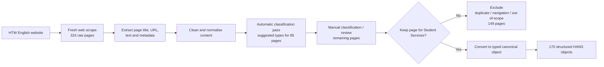

### 4.3 Extraction and cleaning

The object preparation retained the information needed for downstream traceability while reducing webpage noise. The source preparation preserved at least:

```text
page/source title
canonical source URL
main readable text
object identity/type
available metadata / update information
```

The cleaning/normalisation step was intended to prevent retrieval from being dominated by web-page chrome or irrelevant repeated material. In practical terms, the structured object layer separates the **meaningful Student Services content** from navigation, boilerplate and source-page presentation structure.

### 4.4 Classification and curation

The 324 raw pages were not accepted automatically. Raw crawl snapshots were retained as the source material for review, and uncertain pages could remain in a review state rather than being forced directly into a canonical type.

The historical project documentation reports the following classification process:

```text
324 candidate pages
├─ 85 pages received type suggestions from an initial classification script
├─ remaining pages were reviewed/classified manually
├─ uncertain pages could remain temporarily untyped / needs-review during curation
├─ historical narrative reports 149 pages excluded
└─ canonical built-object set contains 170 Student Services objects
```

**Count-reconciliation note:** historical progress counters for scraping, classification and exclusion were recorded at different points and do not form a closed accounting total. The checked-in baseline artefacts provide the operationally relevant result: **170 built canonical JSON objects**. That 170-object set is therefore used throughout this handover as the baseline canonical source count.

Exclusion reasons included:

- duplicate or near-duplicate content;
- navigation pages with little substantive information;
- pages outside the intended Student Services/admissions/study-support scope.

This curation is technically important because the retrieval pipeline cannot compensate reliably for a noisy or incorrectly scoped source corpus.

### 4.5 Canonical object types

The 170 retained pages were represented as **13 typed object categories**.

The later repository audit of the **built JSON object directory** gives the following 170-object distribution. This is preferable for handover to an earlier narrative table whose category counts did not sum cleanly to 170.

| Object type | Built objects | Purpose |
|---|---:|---|
| `degree_program` | 10 | Individual Bachelor/Master programme information |
| `curriculum_page` | 18 | Programme curricula and module/structure information |
| `application_process` | 18 | General application procedures and steps |
| `application_route_rule` | 23 | Route-specific application rules, e.g. portal/uni-assist context |
| `language_proof_rule` | 8 | Language evidence and proficiency requirements |
| `fees_funding_rule` | 9 | Fee/funding information |
| `deadline_rule` | 2 | Semester/application deadline rules |
| `overview_navigation` | 35 | Relevant overview/topic navigation information |
| `special_category` | 30 | Special applicant categories/routes |
| `accessibility_support` | 12 | Accessibility/inclusion support information |
| `faq_support` | 3 | FAQ-style support material |
| `university_profile` | 1 | General university profile information |
| `family_support` | 1 | Family/childcare support information |
| **Total** | **170** | Canonical built-object source layer |

### 4.6 Canonical object schema

Each canonical object is conceptually a structured record rather than a raw webpage dump.

The documented common fields include:

```text
unique object identifier
object type
canonical source URL
textual content
metadata such as source/update information
```

Where a source type contains well-defined attributes, the object can carry additional structured fields. For example, a degree-programme object can expose programme identity, degree type, faculty and application/deadline information instead of leaving all facts buried in one free-text page.

A conceptual representation is:

```json
{
  "object_id": "...",
  "object_type": "degree_program",
  "source_url": "https://www.htw-berlin.de/...",
  "title": "...",
  "content": {
    "full_text": "..."
  },
  "metadata": {
    "last_updated": "...",
    "source": "HTW Berlin"
  },
  "structured_fields": {
    "programme_name": "...",
    "degree_type": "..."
  }
}
```

The exact optional fields vary by object type. The key principle is that each retrieval unit remains traceable to an authoritative source URL and a defined institutional information type.

### 4.7 Why the object layer matters technically

The object layer changes the retrieval problem from:

```text
search across arbitrary raw webpages
```

to:

```text
search across curated, typed, traceable institutional information units
```

This supports:

- source filtering by type;
- document/object-level merging;
- citation traceability;
- programme/route-aware filtering;
- more stable chunking because each object is already topically coherent;
- easier source maintenance and auditing.

---

## 5. Documented baseline retrieval architecture

The documented baseline retrieval design uses the 170 canonical objects in a self-hosted RAG pipeline.

### 5.1 Baseline indexing sequence

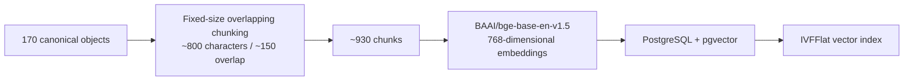

The ~800-character baseline chunk setting is distinct from the **1,000/150** chunking used in the Enhanced PoC Qdrant stack.

### 5.2 Embedding model

The documented baseline uses:

```text
BAAI/bge-base-en-v1.5
vector dimension: 768
language fit: English corpus
```

The same embedding family is used for stored chunks and runtime queries so both exist in the same vector space.

### 5.3 Vector database and index

The baseline uses PostgreSQL with the `pgvector` extension so vector similarity and relational metadata can remain in the same system.

The documented index is **IVFFlat**. Its probe configuration must be tuned to the corpus size; an insufficient probe count can reduce recall even when the source corpus is correct.

### 5.4 Retrieval and similarity

At runtime:

```text
question
-> BGE query embedding
-> cosine-similarity search in pgvector
-> larger candidate set
-> filtering / document-level consolidation
-> selected context for generation
```

Similarity thresholds must be treated as model-specific calibration values, not universal constants. Changing the embedding model changes the score distribution and requires threshold revalidation.

### 5.5 Document-level chunk merging

A naive top-k list may return several chunks from one page. The documented baseline therefore uses **document-level chunk merging** rather than simply discarding duplicates.

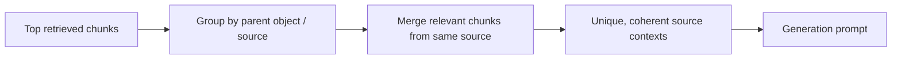

This preserves useful content from multiple chunks belonging to the same canonical source while avoiding a prompt dominated by near-duplicate fragments.

### 5.6 Reranking note

Cross-encoder reranking was evaluated in the baseline work but was **not retained as the final default baseline configuration** because it degraded quality on the narrow institutional corpus. The final baseline therefore relies on calibrated vector retrieval plus document-level merging.

This is different from the Enhanced PoC, where **Cohere reranking was intentionally part of the experiment**.

### 5.7 Baseline generation boundary and runtime verification

The baseline copy is kept as the **reference HANS behaviour**. Its retrieval output is passed to the generator configured for that baseline runtime, but this handover does not use the later HTW-server Qwen path as a baseline-stage label. The HTW-hosted Qwen3 32B and Mac/Ollama Llama 3.1 8B implementations are documented under the **production-readiness version** because they are part of the deployment-oriented model work.

For any baseline reproduction, verify the active baseline configuration rather than assuming the model from a later environment. At minimum record:

```text
baseline endpoint / port
active generation provider
active model name
embedding model
database / retrieval backend
source snapshot or object set
```

This keeps baseline-copy behaviour reproducible without mixing it with the later production-readiness model paths.

---

# Part B – Enhanced PoC (experimental)

## 6. Enhanced PoC scope and separation from the baseline copy

The Enhanced PoC is the experimental implementation developed and evaluated during the thesis. In this handover it is treated as a distinct system version because its retrieval services, vector store, generation providers and workflow integration differ from the baseline copy and from the later production-readiness version.

The Enhanced PoC was deliberately implemented as a **separate experimental environment**. It reused the canonical source basis but did not overwrite the baseline retrieval environment.

The experiment added:

- programme recognition and explicit programme states;
- multi-topic detection;
- one retrieval query per topic;
- programme-specific official evidence;
- limited follow-up/thread context;
- evidence filtering and source applicability controls;
- staff-ready draft generation;
- citations and review metadata;
- deterministic fallback behaviour;
- Gmail/n8n draft integration;
- matched model/system comparisons.

This separation allowed experimental changes to embedding models, vector stores, reranking, prompts and workflow logic without changing the reference baseline copy.

---

## 7. Enhanced PoC data preparation

### 7.1 Reuse of canonical source objects

The Enhanced PoC reused the **170 structured HANS objects** as its general knowledge basis. It did not rebuild the entire baseline source corpus for the frozen experiment.

One object had an empty `full_text` field and was excluded from passage preparation.

### 7.2 Experimental indexing sequence

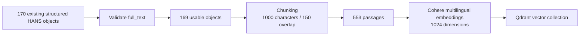

Each passage preserved its source title, URL and available metadata so later steps could support citations, deduplication, programme filtering and manual evaluation.

### 7.3 Why a separate vector collection was required

Embeddings created by different models are not directly comparable. The experimental PoC therefore created a separate Qdrant collection for the Cohere vectors rather than mixing them with vectors created by another embedding model.

At runtime, the topic query was embedded with the **same Cohere embedding model** used for the indexed passages.

---

## 8. Programme identity and programme-specific evidence

### 8.1 Programme catalogue

The programme catalogue acts as an identity/control resource before factual retrieval.

Typical fields/roles:

```text
official programme name
trusted aliases / abbreviations
degree level
canonical programme URL
programme match source / state
```

Programme states used by the Enhanced PoC logic include:

```text
confirmed
unknown
not provided
```

An unknown named programme must not silently fall back to a different programme or to generic programme-specific facts.

### 8.2 Official programme-page cache

A separate official-page evidence cache was introduced because the general canonical source collection did not reliably include every programme subpage.

Typical evidence topics include:

```text
application deadline
required documents
admission requirements
language requirements
language of instruction
study format
work experience
fees / programme-specific application information
```

The programme-page cache **supplements** the 170-object general knowledge basis; it does not replace it.

### 8.3 Source hierarchy principle

For programme-specific questions, the preferred order is conceptually:

```text
confirmed programme identity
-> direct official programme evidence where available
-> relevant general HANS evidence
-> applicability/source checks
-> generation
```

---

## 9. Enhanced PoC runtime request pipeline

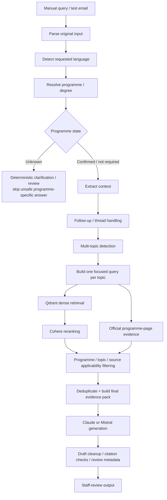

### 9.1 Input and context handling

The original student text is kept separate from internal programme metadata. Confirmed catalogue information can be added to retrieval queries without rewriting the original student message.

Limited thread context is used only to restore information missing from a clear follow-up. Explicit programme changes or uncertain follow-ups require new checks rather than blindly carrying forward previous context.

### 9.2 Multi-topic detection

The detector identifies multiple information needs in a single email. Supported topic families include, among others:

```text
application_deadline
required_documents
application_route
admission_requirements
language_proof
language_of_instruction
fees
study_format
work_experience
related administrative questions
```

One focused evidence query is created for each topic. This prevents a long compound email from becoming one blended vector query dominated by only one subject.

### 9.3 Retrieval and reranking

The Enhanced PoC v4 path uses:

```text
Cohere query embeddings
-> Qdrant dense retrieval
-> Cohere reranking
-> programme/topic filtering
-> direct official programme evidence insertion where applicable
-> smaller final evidence pack
```

The codebase contained a Reciprocal Rank Fusion wrapper, but local keyword search was not active in the evaluated freeze. Therefore the final experiment should not be described as a fully implemented dense + lexical hybrid-search system.

### 9.4 Evidence selection

Evidence selection considers:

- detected topic;
- confirmed programme and degree;
- source type;
- direct programme evidence availability;
- duplicate/near-duplicate results;
- source specificity;
- applicability to the administrative stage.

The goal is not to maximize the number of retrieved passages. The goal is to provide the generator with a **small, applicable and traceable evidence pack**.

### 9.5 Generation

The staff-email modes use the same orchestration path and evidence structure. The main intentional difference is the generation provider:

```text
Claude
Mistral
```

The generator receives:

```text
original email
requested language
programme context
detected topics
selected evidence
source identifiers / citation information
review-oriented instructions
```

The expected output is one coherent staff draft rather than a collection of disconnected QA answers.

### 9.6 Post-generation validation

After generation the system records or checks:

```text
citations
grounding fields
quality information
review reasons
response time
programme/topic metadata
```

These system-generated fields are diagnostic signals, not independent proof of correctness. Source applicability still requires checking whether the evidence belongs to the correct programme, degree, route, stage and topic.

---

## 10. Enhanced PoC operating modes

| Mode | Purpose | Context | Output |
|---|---|---|---|
| Baseline QA | Single-turn experimental QA | No previous turn | Direct answer + sources |
| Conversational QA | Follow-up/context experiment | Temporary session context | Context-aware answer + sources |
| Email Assistant – Claude | Staff-email generation | Email + programme + topics | Reviewable draft + sources/citations |
| Email Assistant – Mistral | Same email path with alternate generator | Email + programme + topics | Reviewable draft + sources/citations |

These are **experimental comparison modes**, not four proposed production interfaces.

---

## 11. Enhanced PoC Gmail/n8n integration

The Enhanced PoC email workflow demonstrated a complete draft-only integration path.

```mermaid
flowchart LR
    A["Labelled Gmail test email"] --> B["Gmail trigger"]
    B --> C["Retrieve complete message"]
    C --> D["Extract / normalise email text"]
    D --> E["Build HANS HTTP payload"]
    E --> F["Call HANS endpoint"]
    F --> G["Review routing"]
    G --> H["Create Gmail draft"]
    H --> I["Append Google Sheet evaluation log"]
    I --> J["Staff review + manual send"]
```

The workflow automated intake, payload preparation, backend processing, review routing, draft creation and evaluation logging. It did **not** send replies automatically.

---

# Part C – Self-hosted transfer and current tested setup

## 12. Transition from the Enhanced PoC to the production-readiness version

The production-readiness version transfers the useful mechanisms validated in the Enhanced PoC into the self-hosted HANS environment while preserving the baseline source/retrieval direction.

Transferred functions include:

```text
programme resources
programme guards
intent / scope routing
multi-topic detection
follow-up classification
conflict handling
evidence filtering
citation logic
review logic
staff-email endpoint
draft-only behaviour
```

This is an architectural adaptation rather than a line-by-line copy of the Enhanced PoC because the baseline copy and the experimental PoC use different data structures, service boundaries and infrastructure components.

---

## 13. HTW-hosted Qwen model path (evaluated path)

The self-hosted transfer evaluated generation using the HTW-hosted service:

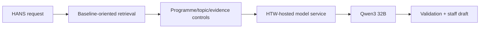

### 13.1 What this proved

The focused server tests showed that selected Enhanced PoC mechanisms could operate in the self-hosted baseline-oriented environment, including later regression fixes for unknown-programme handling and topic detection.

### 13.2 What it did not prove

It did not establish complete production readiness. Recorded generation time through the shared Qwen3 32B service was slower, and a small focused test set is not a full infrastructure benchmark.

For production readiness, the HTW path still requires stable service availability, access control, monitoring, operational ownership and performance validation.

---

## 14. Production-readiness workflow objective

The production-readiness version connects a stable HANS backend to a repeatable institutional email workflow while preserving draft-only human review. The generation layer is kept provider-independent so that the approved self-hosted model can be changed without changing the Apache Hop workflow contract.

The main architecture is:

```text
mailbox
-> Apache Hop orchestration
-> authenticated HANS API
-> programme/topic/retrieval/evidence controls
-> selected self-hosted generation model
-> validation/review metadata
-> Apache Hop response handling
-> Gmail draft
-> staff review/manual send
```

---

## 15. Shared Mac / Ollama Llama path used in the demonstrated setup

A second self-hosted model path has been established using a shared Mac test server.

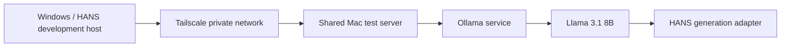

Tested runtime state:

```text
environment         = development
generation_provider = htw_ollama
generation_model    = llama3.1:8b
embedding_model     = BAAI/bge-base-en-v1.5
database            = operational
automatic_send      = false
```

The provider name `htw_ollama` is an application configuration identifier. It should not by itself be interpreted as proof that the current Llama 3.1 8B process is physically hosted on a permanent HTW production server.

### 15.1 Why the Mac path exists

It proves that HANS can use a self-hosted/open-weight generation model through the same service boundary without changing the Apache Hop workflow.

### 15.2 Operational limitation

The current shared MacBook is a development/test host. A permanent Mac Mini or approved HTW server is preferable for a long-lived pilot because the current path depends on the host being powered, connected, reachable through Tailscale and running Ollama.

---

## 16. Generation-provider abstraction

HANS should remain model-independent at the workflow boundary.

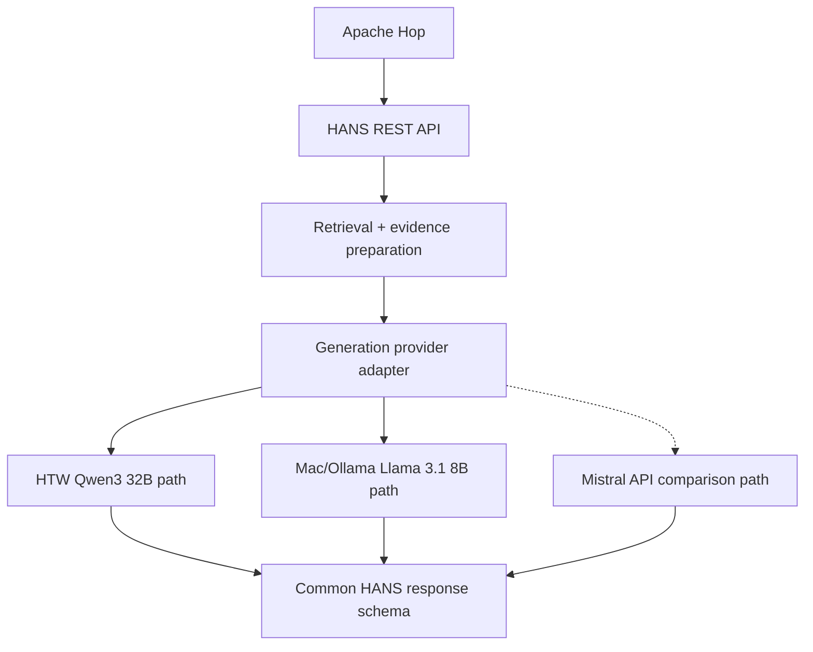

The external Mistral path is a **comparison/experimental option**, not the preferred self-hosted production path.

---

## 17. Retrieval stack used by the current tested setup

The current tested setup uses the following retrieval configuration:

```text
Embedding model: BAAI/bge-base-en-v1.5
Dimensions:      768
Database:        PostgreSQL + pgvector
Active tables:   public.documents / public.web_chunks / public.qa_pairs
DB candidates:   up to 30 before reranking
Reranker:        cross-encoder/ms-marco-MiniLM-L-6-v2
Reranker status: enabled
```

### 17.1 Why BGE is retained

The active general knowledge corpus is primarily English, so `BAAI/bge-base-en-v1.5` remains aligned with the current source design. Multilingual embeddings were not ignored: the Enhanced PoC explicitly tested Cohere multilingual embeddings with Qdrant. Returning to BGE in the self-hosted path avoided changing the embedding space without a matched retrieval validation on the English corpus.

A future switch to a multilingual knowledge base would require re-embedding, threshold recalibration, matched retrieval testing and final-draft regression testing.

### 17.2 Current retrieval flow

```text
topic-specific query
-> BGE query embedding
-> public schema-v1 pgvector search
-> up to 30 candidates
-> MiniLM cross-encoder reranking
-> document-level merging
-> programme / degree / topic / route applicability checks
-> programme-specific official evidence merge
-> topic-aware deduplication and source prioritisation
-> generation evidence pack
```

### 17.3 Reranking status and planned comparison

The accepted September configuration has `cross-encoder/ms-marco-MiniLM-L-6-v2` enabled. This is the configuration used during the recorded acceptance and end-to-end tests, so it is retained as the reference configuration in this handover.

Earlier baseline work showed that this cross-encoder did not consistently improve retrieval on the narrow institutional corpus and was therefore not retained as the baseline default. The Enhanced PoC separately evaluated Cohere reranking. These earlier results justify a controlled comparison, but they do not prove that one reranker is universally better because the experiments used different retrieval stacks.

A matched retrieval experiment is planned with the same source snapshot, queries and evaluation cases:

| Configuration | Retrieval comparison |
|---|---|
| **A - current reference** | BGE + pgvector + MiniLM cross-encoder |
| **B - baseline-style control** | BGE + pgvector + document merging, without cross-encoder reranking |
| **C - alternative reranker** | Same BGE/pgvector candidates with an alternative reranker, such as the Cohere reranking path used in the Enhanced PoC if the comparison environment is available |

The comparison should measure source relevance, correct-source presence in the top results, topic coverage, programme applicability, duplicate/irrelevant evidence, retrieval time, prompt-token impact and downstream draft quality. Any change should be adopted only after the same regression set is rerun.

## 18. Source architecture used by the current service

The current service separates source responsibilities instead of treating every HTW page as interchangeable.

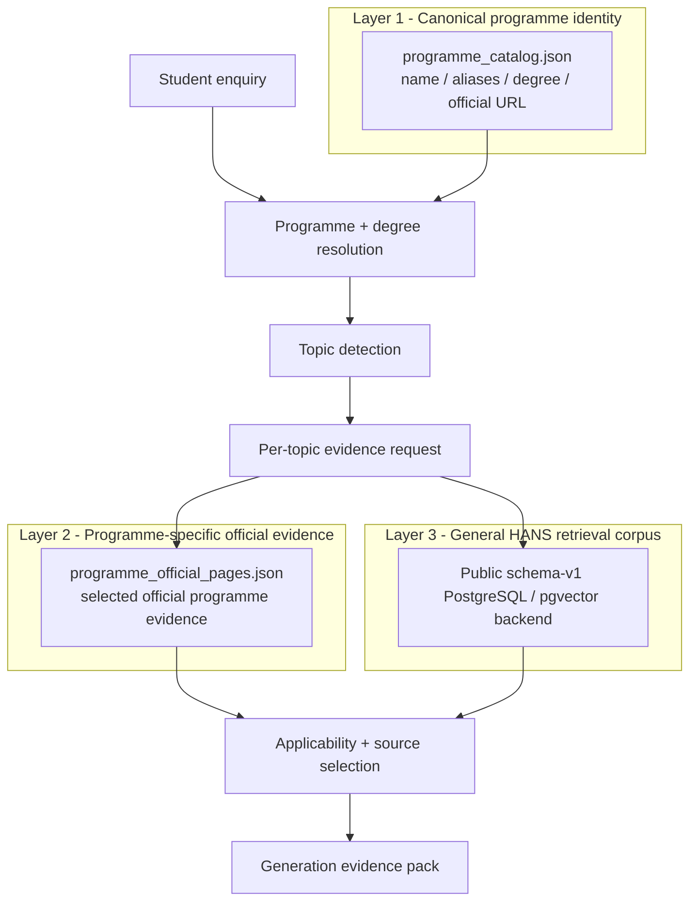

### 18.1 Layer 1 – programme identity

The catalogue should answer identity questions such as:

```text
What programme did the student name?
Is it an HTW programme?
What is the degree level?
Which aliases are trusted?
What is the official programme URL?
```

It should **not** be used as a permanent hard-coded store for changing facts such as deadlines, fees or English-test thresholds.

### 18.2 Layer 2 – programme-specific evidence

The programme-page cache supplies direct source evidence where a general HTW source is too broad. Evidence is selected by **programme + topic**, not merely by URL.

This is important because one programme page may contain several independent factual sections. Two snippets from the same URL may both be necessary if they support different requested topics.

### 18.3 Layer 3 – general retrieval corpus

The configured PostgreSQL/pgvector backend supplies general HTW and cross-programme information. Its candidate results are not accepted solely because they are semantically similar; they are subsequently checked for programme, degree, route, topic and administrative-stage applicability.

---

## 19. Source-count reconciliation and active backend

Several counts appear in project history because they describe different layers. They must not be mixed.

| Source/index layer | Count | Meaning |
|---|---:|---|
| Canonical HANS source preparation | **170 objects** | Curated source-design foundation built from 324 raw English HTW pages |
| Documented baseline index | **about 930 chunks** | Historical baseline index representation of the canonical objects |
| Enhanced PoC experimental index | **169 usable objects / 553 passages** | Cohere multilingual + Qdrant experiment |
| Audited schema-v1 store | **196 documents / 339 web chunks** at the last explicit count audit | Database-row counts from the baseline-oriented PostgreSQL store; not the canonical-object count |
| Fresh V2 candidate | **139 documents / 749 chunks** | Re-scraped/reclassified candidate store; not active in the accepted runtime |

### 19.1 Verified runtime table family

The current retrieval code queries the public schema-v1 HANS tables:

```text
public.documents
public.web_chunks
public.qa_pairs
```

The `hans_v2` schema is referenced by the separate migration and retrieval-test utilities, not by the normal application retrieval path. The V2 source-refresh work should therefore be documented as a controlled candidate experiment rather than as the active knowledge store.

## 20. Fresh V2 source-refresh experiment

The August V2 work is a controlled source-refresh experiment. It was built in separate `hans_v2` tables and was not promoted to the accepted runtime. Any future promotion would require source audit, direct retrieval checks, regression testing and an explicit approval step.

### 20.1 V2 pipeline


### 20.2 Raw crawl traceability

The fresh crawler records information such as:

```text
page ID
URL
HTTP status
content type
raw HTML snapshot path
title
scraped_at timestamp
```

The raw HTML snapshot remains separate from the manifest so a later object can be traced back to the exact captured source page.

### 20.3 Classification and object build

The V2 workflow intentionally prevents every scraped page from becoming retrieval-ready content. Pages can remain `needs_review` until they are safely typed.

Accepted pages are converted to structured JSON objects containing fields such as:

```text
page_id
object_id
object_type
url
title
classification_confidence
classification_notes
source_html_path
scraped_at / last_scraped
last_processed
content.full_text
```

### 20.4 V2 migration result

The controlled V2 migration produced:

```text
139 documents
749 chunks
768-dimensional BGE embeddings
```

The V2 store remains a separate candidate store so retrieval changes can be tested without silently replacing the current public schema-v1 backend.

---

# Part D – Runtime logic, evidence control and prompt design

## 21. Email-processing service flow

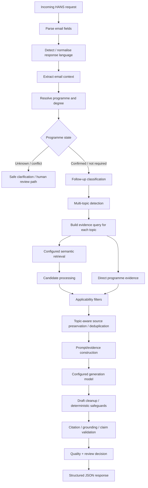

---

## 22. Programme resolution rules

Current programme handling follows a conservative order:

```text
1. Current email body is authoritative when it explicitly names a programme.
2. Subject is fallback/context, not stronger evidence than an explicit body reference.
3. Explicit Bachelor/Master wording must not be overwritten by an incompatible catalogue hint.
4. Subject/body mismatch is recorded rather than silently resolved.
5. An unknown named programme must not silently map to the nearest known programme.
```

For an unknown programme, the safe behaviour is to produce a clarification/review response rather than retrieve generic programme facts and present them as applicable.

---

## 23. Multi-topic processing

The current service detects a set of topics rather than one dominant intent.

Examples:

```text
application_deadline
required_documents
language_of_instruction
english_language_requirements
study_format
application_route
admission_requirements
application_before_graduation
fees
work_experience
german_language_requirements
```

Each topic receives its own base query and then an enriched evidence query using available programme/degree/context information.

This makes topic coverage observable: if a requested topic is absent from the detected-topic list, the retrieval stage cannot recover it later.

---

## 24. Follow-up and thread context

Thread memory is intentionally limited.

It is useful when a later email contains wording such as:

```text
Is that also required?
What about the deadline?
Does the same apply to me?
```

but does not repeat a programme already established in the thread.

Thread context must not become permanent truth. A new programme name, a topic switch, an unclear clarification or unrelated new question requires fresh interpretation.

---

## 25. Applicability filtering and evidence identity

A core current rule is that **semantic relevance is not administrative applicability**.

A candidate source can be rejected or deprioritised when it refers to:

- another programme;
- another degree level;
- a different application route;
- a special applicant category;
- enrolment rather than application;
- an outdated or too-general rule;
- a topic not asked in the current email.

The current evidence logic also distinguishes:

```text
retrieval duplicate
vs.
valid second topic-specific snippet from the same URL
```

Two pieces of evidence from one official page may both be necessary if they support different requested topics. Deduplication must therefore operate on evidence identity, not URL alone.

---

## 26. Deterministic safeguards

Not every safety rule is semantic or model-based.

Current safeguards include or are being tested for:

```text
unknown-programme stop
programme/degree conflict handling
application-stage source-gap handling
study-format evidence checks
unasked-topic/advice cleanup
citation/claim support checks
pending-final-result procedural safeguards
mandatory staff review
```

A lexical/rule-based safeguard may require morphology-aware patterns. For example, semantic retrieval may understand `wait` and `waiting` as related, while a deterministic cleanup rule still needs a pattern that covers the relevant grammatical forms.

---

## 27. Prompt architecture

The current prompting method is best described as **structured, evidence-grounded retrieval-augmented generation (RAG) instruction prompting**. It is mainly zero-shot: the model receives task rules and retrieved official evidence rather than a large set of example answers to imitate.

The current generation path uses two prompt layers plus a structured evidence pack.

Implementation references:

- `app/runtime/local_llm.py::build_email_system_prompt()` — shared HANS system rules;
- `app/runtime/local_llm.py::build_email_user_prompt()` — structured user/evidence prompt;
- `app/email/service.py::_build_strengthened_system_prompt()` — additional email-format and source-to-claim rules;
- `app/email/service.py::_build_topic_evidence_map()` — mapping from detected topics to public `[Doc N]` evidence numbers;
- `app/email/multitopic.py` — topic-specific retrieval and scope instructions.

The final service call assembles the strengthened system prompt and structured user prompt before passing them to the configured generation client.

### 27.1 Shared system rules

Representative rules are:

```text
- Prepare one staff-ready email draft for review.
- Use only the evidence documents supplied in the prompt.
- Answer every detected topic but do not introduce unrelated topics.
- If evidence cannot support a conclusion, say that it could not be confirmed.
- Use programme-specific evidence for programme-specific questions.
- Do not classify formal applicant eligibility.
- Place [Doc N] citations after supported factual claims.
- Preserve the incoming email language.
- Do not expose internal retrieval/model terminology in the student-facing draft.
```

These rules are deliberately stricter than a normal conversational prompt. The goal is controlled transformation of evidence into a staff draft, not open-ended answering.

### 27.2 Strengthened email/source rules

The email service adds rules for common source-to-claim mistakes. Examples include:

```text
- Reply directly to the student/applicant.
- Do not write a Subject line inside the email body.
- Use one greeting and one closing.
- Do not add application-route advice unless route/process is one of the detected topics.
- Cite the document that directly supports each factual claim.
- Do not treat an English-language-proof requirement as proof that a programme is taught in English.
- Do not claim on-campus/online/hybrid/full-time/part-time unless cited evidence states it.
- Use cautious wording when the supplied evidence is incomplete.
```

### 27.3 Structured user/evidence prompt

The user prompt is not one long free-text context block. It contains explicit sections for:

1. response language;
2. interpreted programme/applicant context;
3. topics that must be answered;
4. topic-to-evidence ownership;
5. numbered official evidence blocks;
6. drafting instructions.

A simplified prompt structure is:

```text
REPLY LANGUAGE
English (en)

INTERPRETED CONTEXT
- programme / degree / applicant context ...

TOPICS TO ANSWER
- Application deadline
- Required documents

TOPIC-SPECIFIC EVIDENCE
- Application deadline -> [Doc 1]
- Required documents -> [Doc 2]

OFFICIAL EVIDENCE
[Doc 1] ...
[Doc 2] ...

Create one complete staff-ready email draft.
Use programme-specific evidence first.
Use [Doc N] citations after factual claims.
Do not make unsupported assumptions.
```

### 27.4 Why topic-to-evidence mapping matters

A document can be relevant to an email overall and still be the wrong source for one claim. The topic/evidence mapping makes the evidence ownership visible to the model and to tests. This is particularly important for pairs such as:

- English-language proof vs. language of instruction;
- application process vs. study format;
- application route vs. qualification recognition;
- general HTW rule vs. programme-specific rule.

Tests such as `tests/test_topic_evidence_mapping.py` and `tests/test_topic_evidence_prompt.py` protect this prompt structure.

### 27.5 Language handling

For German requests the prompt explicitly asks for the complete draft in German. Programme names, URLs, source titles and `[Doc N]` citation labels can remain unchanged where necessary.

### 27.6 Missing evidence behaviour

If one requested detail cannot be confirmed, the model should not write an internal note to staff inside the student email. It should use normal student-facing uncertainty, for example that the exact point could not be confirmed from the available official sources.

### 27.7 Prompt design limitation

Prompting cannot repair an upstream information failure. A wrong or incomplete draft may originate from:

`programme resolution → topic detection → source availability → retrieval → applicability filtering → prompt construction → generation → validation`

A stronger model cannot recover a fact that was never retrieved or never passed into the prompt. This is why HANS quality is treated as a pipeline property.

---

## 28. Prompt examples and expected behaviour

### 28.1 Multi-topic programme enquiry

For an MPMD email asking about deadline, documents, teaching language and study format, the system should:

1. resolve the programme and Master context;
2. detect four topics;
3. retrieve evidence for each topic;
4. prefer programme-specific official evidence;
5. map each topic to the `[Doc N]` documents that support it;
6. generate one coherent email covering all four topics;
7. validate citations/claims and require staff review.

### 28.2 Unknown programme

If the student names a programme that cannot be confirmed, HANS should not guess a programme or generate programme-specific deadlines/documents. The safe path asks the student to confirm the official programme name or link. This path can be deterministic and therefore may show no generation token/timing metrics.

### 28.3 Application route and qualification recognition

A dual-citizen email can contain two different questions:

- which application route applies;
- how the foreign school qualification is recognised and whether a VPD is required.

The system keeps these topics separate. EU/EEA citizenship can influence the application route, while foreign qualification recognition may still require its own evidence. A cautious answer is required when the available HTW evidence does not establish a VPD requirement for the applicant's exact qualification.

---

## 29. Deterministic safeguards around generation

Administrative safety does not rely on prompt wording alone. The service contains deterministic controls for selected high-risk behaviours, including:

- unknown-programme handling;
- programme/degree conflict handling;
- application-route invariants;
- unsupported VPD/qualification-recognition claims;
- selected source-to-claim mismatches;
- unasked-topic/scope cleanup;
- mandatory review behaviour.

These controls are intentionally narrow. They reduce known risks but are not a universal fact checker.


# Part E – Apache Hop orchestration and API contract

## 30. Apache Hop responsibility boundary

Apache Hop is the workflow/orchestration layer. It should not duplicate HANS retrieval or generation logic.

### Apache Hop owns

```text
mailbox read/input
field normalisation
email metadata creation
initial HANS relevance routing
HANS configuration loading
request construction
authenticated HTTP call
response parsing
result persistence
draft eligibility routing
Gmail draft payload construction
Gmail draft creation
```

### HANS owns

```text
programme and degree interpretation
follow-up classification
topic detection
retrieval query construction
source retrieval
programme-specific official evidence
applicability filtering
prompt/evidence construction
generation
deterministic safeguards
citations / validation
quality and review metadata
token/timing observability
```

This separation lets the model provider or retrieval logic change without redesigning the Apache Hop pipeline.

---

## 31. Apache Hop pipeline – exact demonstrated flow

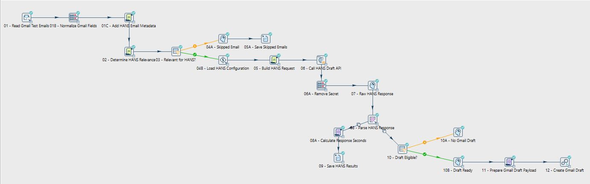

The demonstrated pipeline contains:

```text
01  - Read Gmail Test Emails
01B - Normalize Gmail Fields
01C - Add HANS Email Metadata
02  - Determine HANS Relevance
03  - Relevant for HANS?

04A - Skipped Email
05A - Save Skipped Emails

04B - Load HANS Configuration
05  - Build HANS Request
06  - Call HANS Draft API
06A - Remove Secret
07  - Raw HANS Response
08  - Parse HANS Response
08A - Calculate Response Seconds
09  - Save HANS Results
10  - Draft Eligible?
10A - No Gmail Draft
10B - Draft Ready
11  - Prepare Gmail Draft Payload
12  - Create Gmail Draft
```

### 31.1 Read and normalise

`01 - Read Gmail Test Emails` reads the controlled test mailbox through Gmail/IMAP. `01B` maps connector-specific fields to a stable internal shape. `01C` adds request metadata such as email and thread identifiers.

### 31.2 Relevance routing

`02` and `03` implement a simple, auditable workflow-side decision: send an in-scope email to HANS or keep it on the skipped branch. This routing step is not the same as HANS multi-topic detection.

### 31.3 HANS configuration and request

`04B` loads the configured HANS base URL and internal API key from the runtime environment. `05` builds the JSON payload and `06` performs the authenticated call to `/v1/drafts`.

`06A - Remove Secret` removes the integration secret from the active row after the HTTP call so it is not propagated into later result files.

### 31.4 Parse and record

`07` retains the raw response, `08` parses the structured HANS response, `08A` calculates response seconds, and `09` saves the run result for evaluation/audit use.

### 31.5 Draft gate and Gmail action

`10 - Draft Eligible?` is the last workflow-side gate before creating a draft. The `10A` branch creates no Gmail draft. The `10B → 11 → 12` branch prepares the payload and creates a Gmail Draft.

The workflow does not send the message.

---

## 32. HANS relevance routing

The Hop relevance filter is intentionally simple. It is not responsible for binding administrative decisions.

Useful operational routing states are:

```text
HANS
NOT_HANS
REVIEW
```

An unconfirmed programme is not automatically `NOT_HANS`; it may still be a legitimate enquiry that HANS should handle cautiously.

---

## 33. HANS API endpoints and authentication

### Health

`GET /health`

Useful fields include status, environment, generation provider/model, embedding model, database state and `automatic_send`.

### Draft endpoint

`POST /v1/drafts`

### Authentication

`X-HANS-API-Key: <integration-key>`

The integration key must come from approved local/runtime configuration and must not be committed to the repository.

---

## 34. Typical request schema

```json
{
  "email_text": "Synthetic student enquiry",
  "student_email": "test.student@example.invalid",
  "subject": "Application question",
  "thread_id": "TEST-THREAD-001",
  "email_id": "TEST-EMAIL-001",
  "language": "en",
  "top_k": 6
}
```

`email_text` is the authoritative current message content for programme/topic interpretation. `thread_id` supports controlled follow-up context and `email_id` supports traceability and future duplicate-processing protection.

---

## 35. Important response fields

The structured response contains or may contain:

```text
is_followup
followup_type
flagged_for_human
thread_id
email_id
email_context
detected_topics
staff_draft
citations
sources
validation
quality
conflicts
timing
observability
automatic_send
```

Apache Hop should rely on structured response fields for workflow decisions rather than inferring quality from free-text wording.


# Part F – Evaluation, acceptance and observability

## 36. Evaluation philosophy

HANS quality is treated as a pipeline property rather than a model-only property. Evaluation therefore combines technical checks with manual semantic review of the resulting staff draft.

The project exercised several generation paths during development, including local Mistral, Mistral API comparison models, the HTW-hosted Qwen path when available, and Llama 3.1 8B through Ollama. The Enhanced PoC also used a different retrieval stack with Cohere multilingual embeddings, Qdrant and Cohere reranking.

Some cloud/API model runs were substantially faster and produced strong drafts in several cases. However, the cloud PoC changed retrieval, reranking and generation components at the same time, so output differences cannot be attributed to the generation model alone. The model runs are therefore treated as diagnostic comparisons rather than as a universal ranking.

The protected acceptance run used `llama3.1:8b` with the current retrieval, validation and human-review boundary.

## 37. Eight-case acceptance run

The recorded run used label:

`llama31-8b-final-rc1-0e4219c-2026-09-25`

and produced:

`evaluation/results/llama31-8b-final-rc1-0e4219c-2026-09-25.json`

For easier review, the documentation package also contains derived `CSV` and `XLSX` summaries created from this recorded JSON result. These summaries do not represent a new evaluation run; they are tabular views of the same stored evidence.

The runner verified the provider/model before executing the corpus. All eight cases were recorded and the process exited successfully.

| Case | Main purpose | Recorded runtime evidence |
|---|---|---|
| MM-001 | MPMD multi-topic English | HTTP 200; 3,981 total tokens; 64.092 s generation |
| MM-002 | Unknown programme safety | HTTP 200; deterministic no-generation path |
| MM-003 | MPMD German | HTTP 200; 2,820 total tokens; 58.193 s generation |
| MM-004 | Follow-up first message | HTTP 200; 1,677 total tokens; 28.018 s generation |
| MM-005 | Follow-up second message | HTTP 200; 1,639 total tokens; 30.262 s generation |
| MM-006 | Out-of-scope email | Apache Hop skip; not sent to HANS by design |
| MM-007 | International Business pending graduation | HTTP 200; 3,862 total tokens; 69.632 s generation |
| MM-008 | Dual-citizen route + qualification recognition | HTTP 200; 3,384 total tokens; 55.257 s generation |

### Manual semantic interpretation

The final manual disposition was **four clean passes** (MM-002, MM-005, MM-006, MM-008, with a caution on MM-008 Hochschulstart wording), **two acceptable staff drafts with limitations** (MM-001, MM-003), and **two requiring substantive staff editing** (MM-004, MM-007). MM-004 was scored 60/review with a detected claim/source mismatch; MM-007 was scored 100/good despite a fee/route semantic issue. These are manual dispositions, not a validator pass rate. Every generated runtime draft was manually reviewed.

- **MM-001:** useful staff draft; deadline and teaching-language handling were strong, but the document list was not exhaustive and study-format wording still required care.
- **MM-002:** strong safety behaviour; the system did not invent programme-specific deadlines or documents.
- **MM-003:** functional German draft; wording/document-language nuances still required staff review.
- **MM-004:** the draft needed substantive editing; it is a useful example of why an automated score is not the same as semantic correctness.
- **MM-005:** the English-requirements follow-up was clean and useful.
- **MM-006:** correct skip behaviour by design.
- **MM-007:** manual review identified a fee/application-route wording problem that automated scoring did not catch.
- **MM-008:** route and qualification recognition were kept separate and the VPD conclusion was cautious; staff review remained appropriate.

---

## 38. Why automated scores are not semantic correctness

The validator provides review signals, not a universal fact-checking guarantee. It is strongest at explicitly encoded patterns such as citation structure, selected unsupported phrases and selected source-to-claim mismatches.

A high `quality_score` can coexist with a draft that still needs editing. The system therefore never treats the quality score as permission to send automatically.

Automated validation is a supporting safeguard rather than a complete correctness check. A draft can pass several automated checks and still require factual or administrative correction by staff.

---

## 39. Generation observability

For LLM generation paths, the structured response can expose:

```text
provider
model
prompt_tokens
completion_tokens
total_tokens
model_total_seconds
load_seconds
prompt_eval_seconds
completion_eval_seconds
generation_total_seconds
```

The current token measurement applies to the self-hosted transfer, not retroactively to the baseline copy or Enhanced PoC. The evaluation JSON preserves case/run/model identity and the generation response fields; for generated rows, total tokens equals prompt plus completion tokens. Null generation fields for MM-002 and Hop-skipped MM-006 must not be treated as zero. Model time, generation time and request time are different spans. The source/provider token accounting implementation cannot be independently verified from the run JSON alone. See `model-comparison-and-token-measurement.md` for the five recorded model paths and comparison limits.

The Tkinter UI displays provider/model, prompt/completion/total tokens and generation time. Deterministic safety paths that do not call the LLM can legitimately show `n/a` for generation metrics.

Repeated runs of the same semantic case produced different completion lengths and generation times. This is expected model stochasticity. Reproducibility is therefore based on frozen code, evidence and test cases rather than byte-identical generated prose.

---

## 40. End-to-end Apache Hop evidence

The complete controlled run demonstrated:

`Gmail → Apache Hop → HANS :8013 → Apache Hop → Gmail Draft`

Recorded values were:

| Metric | Value |
|---|---|
| HTTP status | 200 |
| Provider | `htw_ollama` |
| Model | `llama3.1:8b` |
| Prompt tokens | 2,934 |
| Completion tokens | 432 |
| Total tokens | 3,366 |
| Model total time | 64.945 s |
| Generation total time | 65.523 s |
| Human review required | Yes |
| Automatic send | No |
| Gmail action | `draft_created` |
| Sent | `false` |

The Gmail Draft was physically confirmed after the pipeline completed.

The generated route/recognition draft also showed the value of validation: the system kept the VPD conclusion cautious, but it produced an over-strong eligibility/application-route statement. The validator marked manual review for an unsupported eligibility/admission statement even though the heuristic quality score remained high.

---

## 41. Regression and change-control method

The working method used during quality hardening was deliberately narrow:

```text
1. reproduce one failure
2. inspect programme/topic/retrieval/evidence state
3. change one behaviour
4. run focused regression
5. rerun protected cases
6. inspect sources and generated draft manually
7. keep a Git checkpoint only after the change is proven
```

This reduces the risk of solving one case while quietly breaking another.

---

## 42. Retrieval/source audit principle

When an answer is wrong, the first question is not “which model should be used?”. The failure should be located in order:

`topic detection → programme resolution → source presence → retrieval → filtering/deduplication → prompt → generation → validation`

A stronger language model cannot recover a source that was never retrieved or a topic that was never detected.


# Part G – Logging and diagnostic detail

## 43. Logging model

A production-readiness run should preserve enough information to reproduce a failure without storing unnecessary personal data.

Recommended technical fields include:

```text
run/request ID
email/test ID
thread ID
backend / endpoint
provider + model
embedding model
retrieval backend
programme state
programme match source
detected topic IDs
retrieved source IDs/URLs
review flag/reason
validation fields
timing fields
error state
```

Real student personal data should not be copied into general development logs unless operationally necessary and approved.

---

## 44. Regression focus and protected behaviours

The September quality branch/checkpoints cover focused behaviours including:

- body-first programme resolution;
- degree-aware evidence filtering;
- unknown-programme safe handling;
- language-of-instruction topic detection;
- multi-topic coverage;
- study-format evidence correctness;
- removal of unasked advice;
- preservation of topic-specific evidence from the same URL;
- application-stage / pending-final-result safeguards;
- citation/claim support;
- structured and temporal/deadline correctness.

### 44.1 Change-control method

The current development method is:

```text
1. reproduce one failure
2. inspect programme/topic/retrieval/evidence state
3. change one behaviour
4. run focused regression
5. rerun main regression cases
6. inspect sources + draft manually
7. preserve a Git checkpoint/tag
```

This prevents unrelated changes from being combined into one difficult-to-debug patch.

---

## 45. Retrieval/source audit principle

When an answer is wrong, the failure should be located before modifying the LLM.

The audit sequence is:

```mermaid
flowchart LR
    A["Incorrect / incomplete draft"] --> B["Was topic detected?"]
    B --> C["Was programme/degree resolved correctly?"]
    C --> D["Was correct source present in corpus/cache?"]
    D --> E["Was source retrieved?"]
    E --> F["Was it removed during reranking/filtering/deduplication?"]
    F --> G["Did prompt include it?"]
    G --> H["Did generator use it correctly?"]
    H --> I["Did validation catch unsupported claims?"]
```

This separation is critical because improving the generation model cannot fix a source that was never retrieved or an upstream topic that was never detected.

---

# Part H – Security, privacy and operational readiness

## 46. Secrets and configuration boundary

Apache Hop should know only what it needs to call HANS.

It should not require direct access to:

```text
PostgreSQL credentials
pgvector internals
embedding-model configuration
reranker configuration
Mistral secret
Ollama internal configuration
prompt implementation
source-maintenance credentials
```

Do not commit:

```text
.env
API keys
mailbox credentials
production DB credentials
real student emails
personal-data runtime logs
```

---

## 47. Mailbox authentication status

The current Gmail OAuth setup is a testing configuration. This is acceptable for development but not sufficient for a long-running operational service because re-authorization may be required.

The pilot requires a stable, HTW-approved mailbox/OAuth configuration with defined ownership and revocation procedures.

---

## 48. Scheduling and persistent runtime

The demonstrated workflow was run through Apache Hop using the local pipeline engine. The complete controlled path from Gmail input to Gmail Draft was tested successfully.

Long-running scheduling has **not** yet been implemented or tested. The following are future deployment choices rather than completed capabilities:

| Capability | Status |
|---|---|
| Manual/local Apache Hop execution | Implemented and tested |
| Gmail read -> HANS -> Gmail Draft | Implemented and tested |
| Windows Task Scheduler invoking `hop-run` | Future option; not tested |
| `cron` invoking `hop-run` | Future option; not tested |
| Persistent Hop Server + external orchestration | Future option; not tested |
| Fixed-time / periodic polling | Future option; not tested |
| True push/event-driven Gmail trigger | Not implemented |

The scheduling choice should be made together with duplicate-processing protection, retry behaviour, mailbox authentication and monitoring rather than being treated as an isolated configuration change.

## 49. Duplicate-processing protection (idempotency)

Duplicate-processing protection is not yet implemented for a scheduled operational workflow. Before scheduled polling is enabled, the system must ensure that the same email cannot create multiple drafts. In plain terms, the same mailbox item should not cause the same action repeatedly if it is seen again during another polling run.

Before regular automatic execution, the workflow should persist a stable processing identity based on fields such as:

```text
email_id
thread_id
processing status
HANS run/request ID
draft-created status
```

The exact storage mechanism is still an operational design decision, but duplicate prevention is a prerequisite for scheduled mailbox processing.

---

## 50. Error and retry behaviour

A production pilot needs explicit handling for:

```text
mailbox read failure
OAuth/authentication failure
HANS API unavailable
model endpoint unavailable / timeout
invalid JSON / response contract error
database/retrieval error
no applicable evidence
unknown programme
Gmail draft-creation failure
audit-log write failure
```

The current PoC proves the normal flow. The operational version must define which errors are retried, which are routed for manual review, and which stop the run.

---

## 51. Monitoring and operational ownership

The pilot should expose health for at least:

```text
Apache Hop runtime
mailbox authentication
HANS API
PostgreSQL / pgvector
active generation endpoint
source freshness
last successful workflow run
error count / failed requests
```

Operational ownership must also be named for:

```text
mailbox access
source maintenance
HANS backend
model host
workflow scheduler
secrets
incident response
```

---

### 51.1 Knowledge-base maintenance and source refresh

Source maintenance is a separate operational responsibility because a fresh website scrape cannot safely be inserted directly into the vector store. The original HANS knowledge base was created by scraping, cleaning, classifying and reviewing candidate pages before they were converted into the structured HANS object model.

A future refresh process should follow this controlled path:

```text
scan HTW website
-> detect new / changed / removed pages
-> extract content and metadata
-> remove navigation / boilerplate
-> classify page and map it to the existing object types
-> send uncertain pages to a review queue
-> create or update canonical objects
-> chunk and embed into a candidate index
-> run retrieval checks and draft regressions
-> human approval
-> promote the candidate index
```

The V2 source-refresh experiment already demonstrated useful building blocks for this process: raw page snapshots, a manifest, classification/review states, structured object creation and a separate candidate index. It was not activated as the current runtime store.

For a future pilot, the practical goal should be a **one-click or few-click refresh workflow** that automates crawling, change detection, cleaning, object construction, candidate indexing and test execution while keeping a human approval gate before the new source snapshot becomes active. This reduces manual effort without allowing an unreviewed scrape to replace the operational knowledge base.

### Current repository hygiene note

`.env.local` is no longer tracked by Git and remains a local developer configuration file. Historical repository versions may contain an earlier database credential; any still-valid credential should be rotated before broad repository sharing. This repository change does not alter HANS runtime behaviour.


# Part I – Architecture view, recovery and handover

## 52. Current tested architecture

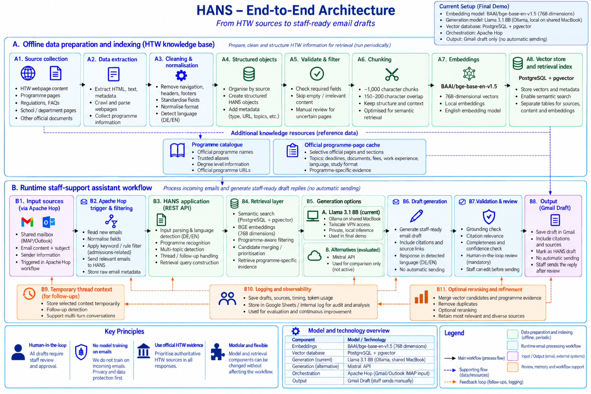

The demonstrated setup can be summarised as:

```text
controlled Gmail input
→ Apache Hop intake/routing
→ authenticated HANS API
→ programme + degree resolution
→ multi-topic detection
→ BGE / PostgreSQL-pgvector retrieval
→ programme-specific official evidence
→ applicability/source control
→ Llama 3.1 8B generation through Ollama
→ deterministic safeguards + validation
→ Apache Hop response handling
→ Gmail Draft
→ staff review and manual send
```

Historical Qwen, Mistral, Cohere/Qdrant and Gmail/n8n paths remain important evaluation history but are not simultaneous components of the demonstrated runtime.

---

## 53. Operational recovery and smoke-test checklist

When resuming the project on another machine or after a regression:

```text
1. Confirm intended Git branch/checkpoint.
2. Confirm working tree state.
3. Restore local environment/secrets without committing them.
4. Start/confirm PostgreSQL and required services.
5. Call GET /health.
6. Confirm generation provider/model.
7. Confirm embedding model.
8. Confirm configured retrieval backend/source snapshot.
9. Run programme-resolution tests.
10. Run multi-topic tests.
11. Run source-applicability/study-format/scope regressions.
12. Run the protected HANS regression/acceptance set.
13. Run Apache Hop Gmail integration.
14. Confirm automatic_send = false.
15. Confirm Gmail Draft is created only through the intended branch.
```

---

## 54. Ownership split for a future pilot

### Workflow / Apache Hop maintainer

Owns the HANS base URL and API contract, approved integration-key configuration, mailbox configuration, routing rules, scheduler/runtime configuration, retry/error policy, audit-output location and duplicate-processing mechanism.

### Knowledge / source maintainer

Owns the HTW website refresh process, page-change review, content cleaning, classification, canonical-object quality, source freshness, programme catalogue, programme-specific official evidence and approval of a candidate source/index snapshot before activation.

### HANS backend maintainer

Owns retrieval configuration, applicability filtering, evidence merging, model adapter, prompt construction, deterministic safeguards, validation/regression tests and API compatibility. The backend maintainer works with the source maintainer when a source change affects retrieval or answer behaviour.

### Infrastructure / model maintainer

Owns the approved model host, Ollama/model service availability, private network access, resource capacity, monitoring, model version control and security updates.

## 55. Completed implementation work and future operational work

Several tasks listed as “remaining” in the September 4 handover were completed before the current tested reference:

- stable backend quality checkpoint created;
- protected regression/acceptance run completed;
- Llama 3.1 8B local generation path demonstrated;
- token and timing observability added to API/evaluation/UI;
- Apache Hop → HANS → Gmail Draft reconfirmed against the tested application;
- Gmail Draft physically confirmed;
- repository environment configuration removed from Git tracking.

Future operational work, not claimed as completed, includes:

- duplicate-processing protection for scheduled polling;
- defined retry/error/manual-review policy;
- managed Apache Hop runtime/scheduler;
- stable institutionally approved mailbox authentication;
- production monitoring and named operational ownership;
- privacy/security review for regular processing of real student mail;
- stable production model host and source-freshness process;
- controlled reranker comparison using the same source snapshot and evaluation cases;
- controlled prompt/evidence token-reduction study without changing the accepted reference configuration.

---

## 56. Code-review entry points

A reviewer should start with:

1. `enhanced_api_server.py`
2. `app/email/service.py`
3. `app/email/multitopic.py`
4. `app/knowledge/programme_catalog.py`
5. `app/knowledge/programme_context.py`
6. `app/knowledge/programme_official_evidence.py`
7. `app/retrieval/`
8. `app/runtime/`
9. `app/validation/email_validator.py`
10. `enhanced_email_ui.py`
11. `apache-hop/hans_gmail_draft_demo.hpl`
12. `apache-hop/create_gmail_draft_imap.py`
13. `evaluation/run_multimodel_evaluation.py`
14. protected tests and the recorded acceptance artefact.

The detailed review checklist is maintained in `code-review-guide.md`.

---

## 57. Version and checkpoint history

| Reference | Meaning |
|---|---|
| `0e4219c` | Backend quality checkpoint used for acceptance |
| `9fee966` | Commit recording the Llama acceptance artefact |
| `6dafee6` | Tested application state with UI observability and curated demos |
| `checkpoint-2026-09-25-final-ui-observability` | Tag on the tested application |
| `checkpoint-2026-09-25-final-e2e` | Tag confirming successful end-to-end workflow |
| `251fddf` | Post-freeze repository/environment-security hygiene |

The behavioural reference remains `6dafee6`.

---

## 58. Interpretation rule

Historical components must not be described as if they are all active at once. In particular:

- Cohere multilingual embeddings + Qdrant belong to the Enhanced PoC;
- BGE + PostgreSQL/pgvector belong to the baseline/current retrieval direction;
- the active current retrieval path uses the public schema-v1 tables;
- MiniLM cross-encoder reranking is enabled in the current tested configuration;
- the separate `hans_v2` source-refresh store is experimental and not active;
- Qwen3 32B was an evaluated self-hosted path, not the active generator in the demonstrated setup;
- Mistral is a comparison path;
- Llama 3.1 8B via Ollama is the active generator in the demonstrated setup;
- Gmail/n8n is historical integration work;
- Apache Hop is the demonstrated orchestration path.

Source counts and index counts describe different layers and should not be compared without context.


## 59. Current system status and handover position

HANS currently provides a tested staff-support workflow from email intake through evidence retrieval, draft generation, validation and Gmail Draft creation. The system deliberately keeps the final review and sending decision with staff.

The next engineering priorities are source-maintenance automation, stable mailbox operation, duplicate-processing protection, monitoring, and controlled retrieval/performance improvements. Changes to retrieval, reranking, prompts or models should continue to be evaluated against the existing test set before they are adopted.

For repository handover, the preferred end state is one clearly reviewed default `main` branch containing the approved application and documentation, while historical states remain available through tags and version history. The current feature branch should therefore be reviewed and merged only after the documentation and code-review pass are complete.

## Appendix A. Source and index count reconciliation

Several counts appear in the project history because they describe different layers. They should not be compared as if they were the same unit.

| Layer | Count | Meaning |
|---|---:|---|
| Raw English HTW crawl | 324 pages | Candidate webpages before curation |
| Canonical HANS source layer | 170 objects | Curated, typed Student Services objects |
| Documented baseline index | about 930 chunks | Baseline chunk/index representation of the canonical objects |
| Enhanced PoC index | 169 usable objects / 553 passages | Cohere + Qdrant experimental representation |
| Audited public schema-v1 store | 196 documents / 339 web chunks | Database-table counts from the baseline-oriented backend at the last explicit audit |
| V2 source-refresh candidate | 139 documents / 749 chunks | Controlled fresh-crawl candidate, not automatically active |

The **170-object count is the canonical source-design foundation**. A database can contain a different number of rows because indexing, migration and chunking produce different storage representations.

---

## Appendix B. Detailed prompt audit checklist

When reviewing the prompt implementation, check the following in order:

### System prompt

- evidence-only rule is present;
- binding eligibility/admission decisions are prohibited;
- every detected topic must be answered;
- unrelated topics are prohibited;
- programme-specific evidence is preferred;
- missing evidence produces cautious wording;
- the requested language is preserved;
- citations use public `[Doc N]` numbers.

### Strengthened email rules

- the draft is addressed to the student/applicant;
- the body does not contain a separate Subject line;
- there is one greeting and one closing;
- route advice is scoped to route/process topics;
- language-of-instruction is not inferred from language-proof rules;
- study format is not inferred from generic application pages;
- internal terms such as retrieval, grounding or staff notes do not leak into the student-facing draft.

### User/evidence prompt

- interpreted context is separated from the student's original text;
- all detected topics are listed;
- topic-to-evidence mapping is present where available;
- numbered evidence blocks preserve source title and URL identity;
- programme-specific evidence is not silently replaced by a generic source;
- evidence missing for one topic does not cause evidence from another topic to be reused incorrectly.

### Regression expectation

Any prompt change should be followed by prompt-structure tests, focused regression, protected acceptance cases and manual semantic review of the generated draft.

---

## Appendix C. Validation capability and limitation matrix

| Area | What the system can check | What still needs human review |
|---|---|---|
| Citation syntax | Whether `[Doc N]` references are present/within known range | Whether the cited source truly supports the exact wording |
| Grounding structure | Whether sources/citations exist and selected rules pass | Whether every important claim is semantically justified |
| Unsupported phrase rules | Selected explicitly encoded high-risk wording | New wording patterns not covered by rules |
| Programme state | Known/unknown/conflict handling | Ambiguous real-world naming or applicant intent |
| Route safeguards | Selected EU/EEA / uni-assist invariants | Complex or exceptional applicant cases |
| Qualification/VPD guard | Prevent selected unsupported definitive claims | Formal recognition decision for a specific certificate |
| Topic coverage | Whether requested topic families are detected/answered | Whether the answer is complete enough for staff use |
| Quality score | Heuristic review signal | Overall semantic correctness and send readiness |

The key interpretation rule is that validation metadata supports staff review; it does not replace it.

---

## Appendix D. Acceptance case notes

### MM-001 – MPMD multi-topic English

Purpose: combine deadline, required documents, language of instruction and study-format questions.

Recorded generation: 3,981 total tokens; 64.092 seconds. Manual review found the deadline and teaching-language content useful, while the document list was not fully exhaustive and study-format wording still required care.

### MM-002 – Unknown programme

Purpose: verify safe handling when the named programme cannot be confirmed.

No LLM generation call was made. This is expected. The deterministic response avoided fabricated programme-specific facts and demonstrated that “no generation metrics” can be correct behaviour.

### MM-003 – German response

Purpose: verify German drafting while preserving programme/source names and citations.

Recorded generation: 2,820 total tokens; 58.193 seconds. The output was functional, but staff review remained necessary for wording and document-language nuances.

### MM-004 – Follow-up first message

Purpose: exercise follow-up/regression behaviour for an MPMD deadline question.

Recorded generation: 1,677 total tokens; 28.018 seconds. Manual review showed substantive editing was still needed. This is one of the examples used to show that automated indicators do not equal send readiness.

### MM-005 – Follow-up second message

Purpose: continue the thread with English-language-requirement context.

Recorded generation: 1,639 total tokens; 30.262 seconds. The result was comparatively clean and useful in the protected run.

### MM-006 – Out-of-scope

Purpose: verify Apache Hop routing.

The message was not sent to HANS by design. This is a workflow success, not a missing result.

### MM-007 – International Business pending graduation

Purpose: answer pending-final-result, English and application-fee context.

Recorded generation: 3,862 total tokens; 69.632 seconds. Manual review identified a fee/route wording problem that the automated score did not catch. This is an important semantic-validator limitation example.

### MM-008 – Dual-citizen route and qualification recognition

Purpose: keep application route separate from foreign qualification recognition/VPD.

Recorded generation: 3,384 total tokens; 55.257 seconds. The protected corpus result was useful and cautious on VPD. A later Gmail end-to-end run using similar route/recognition content also showed why staff review remains required.

---

## Appendix E. End-to-end evidence interpretation

The final Gmail demonstration produced a structured HANS response and a real Gmail Draft. Important evidence includes:

```text
HTTP status                 200
provider                    htw_ollama
model                       llama3.1:8b
prompt_tokens               2934
completion_tokens           432
total_tokens                3366
model_total_seconds         64.945
generation_total_seconds    65.523
flagged_for_human           true
review_required             true
automatic_send              false
Gmail action                draft_created
sent                        false
helper exit code            0
```

The Hop execution therefore proves both integration and safety behaviour: the pipeline was able to create the draft, while the backend still required human review and refused automatic sending.

The semantic review also matters. The draft contained useful route/recognition information and a cautious VPD statement, but it included an eligibility/application-route sentence that was too strong for the available evidence. The validator recognised an unsupported eligibility/admission issue. The case should therefore be presented as evidence of a **working human-supervised workflow**, not as proof that every generated sentence is safe without review.

---

## Appendix F. Repository review checklist

### Entry points

- [ ] `enhanced_api_server.py` defines the service boundary expected by Apache Hop.
- [ ] `/health` reports provider/model/embedding/database/automatic-send state.
- [ ] `/v1/drafts` requires the intended authentication header.

### Email service

- [ ] `app/email/service.py` remains the main orchestration layer for programme, topic, evidence, prompt, generation and validation.
- [ ] body-first programme interpretation remains intact.
- [ ] unknown programme does not silently fall back to another programme.
- [ ] route and qualification-recognition topics stay separate.

### Retrieval

- [ ] BGE query embeddings match the indexed vector family.
- [ ] PostgreSQL/pgvector is the active demonstrated vector store.
- [ ] programme-specific official evidence is preserved by programme + topic.
- [ ] same-URL evidence is deduplicated by evidence identity rather than URL only.
- [ ] reranking is described as configurable rather than assumed mandatory.

### Generation

- [ ] Llama 3.1 8B/Ollama is documented as the active demonstrated generator.
- [ ] Mistral remains a comparison path.
- [ ] Qwen remains an evaluated self-hosted path rather than the active submission generator.
- [ ] prompt rules do not claim universal semantic safety.

### Validation

- [ ] automatic sending remains disabled.
- [ ] review-required state is preserved through the API/Hop flow.
- [ ] `quality_score` is not used as a send-authorisation signal.

### Apache Hop

- [ ] secrets are loaded from runtime configuration rather than hard-coded in the pipeline.
- [ ] `06A - Remove Secret` remains after the HTTP call.
- [ ] skipped messages do not enter the HANS branch.
- [ ] draft creation is gated by `10 - Draft Eligible?`.
- [ ] the Gmail helper creates a draft and does not send.

### Security

- [ ] `.env` and `.env.local` are not tracked.
- [ ] no mailbox password or API key is present in tracked files.
- [ ] historical credentials are rotated before broad access if still valid.

---

## Appendix G. Operational readiness matrix

| Area | Demonstrated in current tested setup | Needed for managed pilot |
|---|---|---|
| HANS API | Yes | Managed service ownership and monitoring |
| BGE/pgvector retrieval | Yes | Source/index lifecycle and freshness process |
| Local generation | Yes | Stable approved host and capacity planning |
| Apache Hop flow | Yes | Managed scheduler/persistent runtime |
| Gmail Draft creation | Yes | Institutionally approved mailbox/authentication |
| Human review | Yes | Staff process/ownership definition |
| Token/timing observability | Yes | Central monitoring/log retention policy |
| Duplicate-processing protection | Not fully implemented | Required before scheduled polling |
| Retry/error routing | Partial/development | Explicit policy required |
| Privacy/security review | Development controls present | Formal approval required for regular real mail |

---

## Appendix H. Glossary

**Applicability filtering** — checking whether a retrieved source applies to the correct programme, degree, route, topic and administrative stage.

**Apache Hop** — the workflow tool that reads/routes mailbox input, calls HANS, parses the response and creates a Gmail Draft.

**BGE** — the embedding model family used in the current retrieval direction; the demonstrated setup uses `BAAI/bge-base-en-v1.5` with 768 dimensions.

**Canonical object** — a curated, typed HANS knowledge unit derived from official HTW source material.

**Deterministic safeguard** — a rule implemented in code rather than left to model interpretation.

**Duplicate-processing protection / idempotency** — preventing the same mailbox item from creating repeated actions when it is seen again.

**Evidence pack** — the selected numbered source excerpts supplied to the language model for one request.

**Human-in-the-loop** — the workflow requires staff review and manual sending rather than autonomous action.

**Observability** — technical information that helps explain a run, such as provider/model, token counts, timings and review status.

**Programme catalogue** — controlled resource containing programme identity information such as official name, aliases, degree level and URL.

**Programme-specific evidence** — selected official HTW evidence linked to a programme and topic.

**RAG** — Retrieval-Augmented Generation: retrieve relevant evidence first, then generate from that evidence.

**Source-to-claim check** — a check that the evidence cited for a statement is appropriate for that statement.

**Topic-to-evidence mapping** — explicit mapping from each detected question/topic to the `[Doc N]` evidence intended to support it.
