# HANS – Highly Automated Natural Language Support System
## Consolidated Architecture, Implementation, Data Lineage and Production-Readiness Handover

**Use case:** Staff-facing support for student enquiries at HTW Berlin
**Status date:** 04 September 2026
**Current status:** Working integration PoC moving toward an operational self-hosted pilot
**Safety principle:** Draft only; staff review is mandatory; no automatic sending
**Primary language of the current knowledge corpus:** English

---

## 1. Purpose and scope of this document

This document is the detailed technical handover for HANS, the **Highly Automated Natural Language Support System**. It documents the complete technical evolution of the system in three versions:

1. **Baseline copy version** – the reference HANS implementation, including the original English HTW source preparation, canonical object layer, PostgreSQL/pgvector retrieval direction and source-based QA reference behaviour.
2. **Enhanced PoC** – the experimental staff-support implementation that added programme recognition, programme-specific evidence, multi-topic processing, follow-up handling, alternative retrieval/generation components, validation and Gmail/n8n draft integration.
3. **Production-readiness version** – the current implementation path that transfers the useful Enhanced PoC mechanisms into the self-hosted HANS environment and adds HTW-server Qwen, Mac/Ollama Llama, Apache Hop, Gmail draft creation, source/retrieval audits, regression controls and the operational controls required for a pilot.

The sections below preserve the implementation detail for each version while keeping their data stores, models, workflows and evaluation status clearly separated.

### 1.1 Status vocabulary used in this document

| Status | Meaning |
|---|---|
| **BASELINE** | Existing HANS reference implementation or its documented source/retrieval design |
| **ENHANCED POC** | Implemented and evaluated in the experimental Enhanced PoC; not the final production architecture |
| **PRODUCTION-READINESS / CURRENT** | Implemented and currently used or tested in the September 2026 production-readiness setup |
| **CANDIDATE / CONTROLLED TEST** | Built or available, but not automatically active in the current runtime path |
| **PLANNED / REQUIRED** | Needed for the operational pilot but not yet fully implemented or approved |

---

## 2. System evolution at a glance

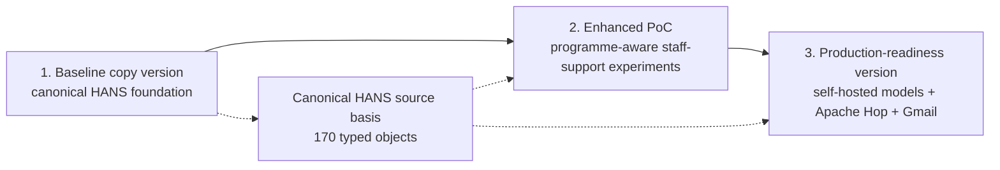

### 2.1 What each stage contributes

| Version | Main technical contribution | Role in the current project |
|---|---|---|
| Baseline copy version | English HTW source preparation, 170 typed canonical objects, BGE embeddings, PostgreSQL + pgvector, document-level merging and HANS reference architecture | Reference foundation and reusable source/retrieval design |
| Enhanced PoC | Programme recognition and programme states, one query per detected topic, programme-specific evidence, follow-up context, Cohere/Qdrant retrieval experiment, Claude/Mistral generation comparison, validation/review logic and Gmail/n8n draft workflow | Evaluated enhancement layer and source of the mechanisms carried forward |
| Production-readiness version | Transfer of useful Enhanced PoC mechanisms to the self-hosted HANS direction; HTW Qwen3 32B and Mac/Ollama Llama 3.1 8B model paths; BGE + pgvector retrieval; Apache Hop orchestration; Gmail draft creation; audits, regression testing, scheduling, security and operational hardening | Active implementation toward an operational pilot |

### 2.2 Version-specific technical stack summary

| Technical layer | Baseline copy version | Enhanced PoC | Production-readiness version |
|---|---|---|---|
| Knowledge basis | 170 typed canonical HANS objects from curated English HTW pages | Same 170-object source basis plus programme catalogue and selected official programme-page cache | Baseline-oriented PostgreSQL source layer plus programme catalogue/official evidence; V2 source refresh remains controlled until activated |
| Chunking/indexing | ~800-character chunks, ~150 overlap; documented ~930 chunks | 1,000-character passages, 150 overlap; 169 usable objects → 553 passages | BGE-compatible PostgreSQL/pgvector retrieval; active table family must be verified from runtime configuration |
| Embeddings | `BAAI/bge-base-en-v1.5`, 768 dimensions | Cohere multilingual embeddings, 1,024 dimensions | `BAAI/bge-base-en-v1.5`, 768 dimensions |
| Vector store | PostgreSQL + pgvector | Qdrant | PostgreSQL + pgvector |
| Reranking/order | Final baseline direction: calibrated vector retrieval + document-level merging; cross-encoder not retained as default | Cohere reranking used experimentally | Reranking remains configurable and must be compared against calibrated BGE/document-merging retrieval before pilot freeze |
| Generation | Baseline-configured reference generation path; preserve baseline behaviour independently from later server experiments | Claude and Mistral comparison | HTW-hosted Qwen3 32B and Mac/Ollama Llama 3.1 8B paths; external Mistral only as comparison option |
| Email integration | Not the primary baseline function | Gmail + n8n draft-only experiment | Apache Hop → HANS → Gmail draft integration |
| Human control | Staff-facing support | Draft/review workflow | Draft only; staff review and manual send mandatory |

This matrix is the quickest way to identify which technical setting belongs to which version. The detailed sections below give the implementation and operational rationale.

---

# PART A – BASELINE COPY VERSION

## 3. Baseline role and architectural boundary

The HANS baseline copy is the reference system. It is kept separate from later enhancement code so that changes to retrieval, prompts, models or workflow integration do not silently modify the baseline behaviour.

The baseline is important for two reasons:

- it provides the **canonical knowledge-source design** that later work builds on;
- it provides a **reference behaviour** against which enhanced mechanisms can be compared.

The baseline source preparation should therefore be understood independently from the later Enhanced PoC re-indexing and the later V2 source-refresh experiment.

---

## 4. Initial HANS source preparation – raw website to canonical objects

This section documents the complete baseline-copy data lineage from raw public webpages to retrieval-ready canonical objects.

### 4.1 Source scope

The initial HANS knowledge-base construction started from a fresh scrape of the **English-language HTW Berlin website**, centred on the public English site under `https://www.htw-berlin.de/en/`. The crawl produced:

```text
324 raw HTW web pages
```

These pages were treated as a **candidate corpus**, not as retrieval-ready knowledge.

The raw pages varied substantially:

- programme and admission pages with dense factual content;
- application-process pages;
- language and fee information;
- navigation/overview pages;
- near-duplicates;
- pages outside the Student Services scope;
- pages containing several unrelated topics.

The central design decision was therefore to curate and type the source material **before** relying on semantic retrieval.

### 4.2 End-to-end baseline object-preparation flow

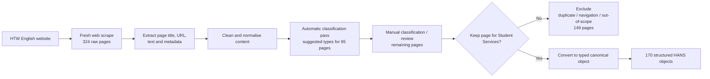

### 4.3 Extraction and cleaning

The object preparation retained the information needed for downstream traceability while reducing webpage noise. The source preparation preserved at least:

```text
page/source title
canonical source URL
main readable text
object identity/type
available metadata / update information
```

The cleaning/normalisation step was intended to prevent retrieval from being dominated by web-page chrome or irrelevant repeated material. In practical terms, the structured object layer separates the **meaningful Student Services content** from navigation, boilerplate and source-page presentation structure.

### 4.4 Classification and curation

The 324 raw pages were not accepted automatically. Raw crawl snapshots were retained as the source material for review, and uncertain pages could remain in a review state rather than being forced directly into a canonical type.

The historical project documentation reports the following classification process:

```text
324 candidate pages
├─ 85 pages received type suggestions from an initial classification script
├─ remaining pages were reviewed/classified manually
├─ uncertain pages could remain temporarily untyped / needs-review during curation
├─ historical narrative reports 149 pages excluded
└─ canonical built-object set contains 170 Student Services objects
```

**Count-reconciliation note:** historical progress counters for scraping, classification and exclusion were recorded at different points and do not form a closed accounting total. The checked-in baseline artefacts provide the operationally relevant result: **170 built canonical JSON objects**. That 170-object set is therefore used throughout this handover as the baseline canonical source count.

Exclusion reasons included:

- duplicate or near-duplicate content;
- navigation pages with little substantive information;
- pages outside the intended Student Services/admissions/study-support scope.

This curation is technically important because the retrieval pipeline cannot compensate reliably for a noisy or incorrectly scoped source corpus.

### 4.5 Canonical object types

The 170 retained pages were represented as **13 typed object categories**.

The later repository audit of the **built JSON object directory** gives the following 170-object distribution. This is preferable for handover to an earlier narrative table whose category counts did not sum cleanly to 170.

| Object type | Built objects | Purpose |
|---|---:|---|
| `degree_program` | 10 | Individual Bachelor/Master programme information |
| `curriculum_page` | 18 | Programme curricula and module/structure information |
| `application_process` | 18 | General application procedures and steps |
| `application_route_rule` | 23 | Route-specific application rules, e.g. portal/uni-assist context |
| `language_proof_rule` | 8 | Language evidence and proficiency requirements |
| `fees_funding_rule` | 9 | Fee/funding information |
| `deadline_rule` | 2 | Semester/application deadline rules |
| `overview_navigation` | 35 | Relevant overview/topic navigation information |
| `special_category` | 30 | Special applicant categories/routes |
| `accessibility_support` | 12 | Accessibility/inclusion support information |
| `faq_support` | 3 | FAQ-style support material |
| `university_profile` | 1 | General university profile information |
| `family_support` | 1 | Family/childcare support information |
| **Total** | **170** | Canonical built-object source layer |

### 4.6 Canonical object schema

Each canonical object is conceptually a structured record rather than a raw webpage dump.

The documented common fields include:

```text
unique object identifier
object type
canonical source URL
textual content
metadata such as source/update information
```

Where a source type contains well-defined attributes, the object can carry additional structured fields. For example, a degree-programme object can expose programme identity, degree type, faculty and application/deadline information instead of leaving all facts buried in one free-text page.

A conceptual representation is:

```json
{
  "object_id": "...",
  "object_type": "degree_program",
  "source_url": "https://www.htw-berlin.de/...",
  "title": "...",
  "content": {
    "full_text": "..."
  },
  "metadata": {
    "last_updated": "...",
    "source": "HTW Berlin"
  },
  "structured_fields": {
    "programme_name": "...",
    "degree_type": "..."
  }
}
```

The exact optional fields vary by object type. The key principle is that each retrieval unit remains traceable to an authoritative source URL and a defined institutional information type.

### 4.7 Why the object layer matters technically

The object layer changes the retrieval problem from:

```text
search across arbitrary raw webpages
```

to:

```text
search across curated, typed, traceable institutional information units
```

This supports:

- source filtering by type;
- document/object-level merging;
- citation traceability;
- programme/route-aware filtering;
- more stable chunking because each object is already topically coherent;
- easier source maintenance and auditing.

---

## 5. Documented baseline retrieval architecture

The documented baseline retrieval design uses the 170 canonical objects in a self-hosted RAG pipeline.

### 5.1 Baseline indexing sequence

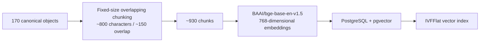

The ~800-character baseline chunk setting is distinct from the **1,000/150** chunking used in the Enhanced PoC Qdrant stack.

### 5.2 Embedding model

The documented baseline uses:

```text
BAAI/bge-base-en-v1.5
vector dimension: 768
language fit: English corpus
```

The same embedding family is used for stored chunks and runtime queries so both exist in the same vector space.

### 5.3 Vector database and index

The baseline uses PostgreSQL with the `pgvector` extension so vector similarity and relational metadata can remain in the same system.

The documented index is **IVFFlat**. Its probe configuration must be tuned to the corpus size; an insufficient probe count can reduce recall even when the source corpus is correct.

### 5.4 Retrieval and similarity

At runtime:

```text
question
-> BGE query embedding
-> cosine-similarity search in pgvector
-> larger candidate set
-> filtering / document-level consolidation
-> selected context for generation
```

Similarity thresholds must be treated as model-specific calibration values, not universal constants. Changing the embedding model changes the score distribution and requires threshold revalidation.

### 5.5 Document-level chunk merging

A naive top-k list may return several chunks from one page. The documented baseline therefore uses **document-level chunk merging** rather than simply discarding duplicates.

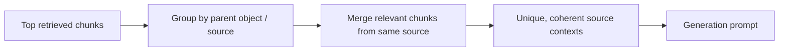

This preserves useful content from multiple chunks belonging to the same canonical source while avoiding a prompt dominated by near-duplicate fragments.

### 5.6 Reranking note

Cross-encoder reranking was evaluated in the baseline work but was **not retained as the final default baseline configuration** because it degraded quality on the narrow institutional corpus. The final baseline therefore relies on calibrated vector retrieval plus document-level merging.

This is different from the Enhanced PoC, where **Cohere reranking was intentionally part of the experiment**.

### 5.7 Baseline generation boundary and runtime verification

The baseline copy is kept as the **reference HANS behaviour**. Its retrieval output is passed to the generator configured for that baseline runtime, but this handover does not use the later HTW-server Qwen path as a baseline-stage label. The HTW-hosted Qwen3 32B and Mac/Ollama Llama 3.1 8B implementations are documented under the **production-readiness version** because they are part of the deployment-oriented model work.

For any baseline reproduction, verify the active baseline configuration rather than assuming the model from a later environment. At minimum record:

```text
baseline endpoint / port
active generation provider
active model name
embedding model
database / retrieval backend
source snapshot or object set
```

This keeps baseline-copy behaviour reproducible without mixing it with the later production-readiness model paths.

---

# PART B – ENHANCED POC (EXPERIMENTAL)

## 6. Enhanced PoC scope and separation from the baseline copy

The Enhanced PoC is the experimental implementation developed and evaluated during the thesis. In this handover it is treated as a distinct system version because its retrieval services, vector store, generation providers and workflow integration differ from the baseline copy and from the later production-readiness version.

The Enhanced PoC was deliberately implemented as a **separate experimental environment**. It reused the canonical source basis but did not overwrite the baseline retrieval environment.

The experiment added:

- programme recognition and explicit programme states;
- multi-topic detection;
- one retrieval query per topic;
- programme-specific official evidence;
- limited follow-up/thread context;
- evidence filtering and source applicability controls;
- staff-ready draft generation;
- citations and review metadata;
- deterministic fallback behaviour;
- Gmail/n8n draft integration;
- matched model/system comparisons.

This separation allowed experimental changes to embedding models, vector stores, reranking, prompts and workflow logic without changing the reference baseline copy.

---

## 7. Enhanced PoC data preparation

### 7.1 Reuse of canonical source objects

The Enhanced PoC reused the **170 structured HANS objects** as its general knowledge basis. It did not rebuild the entire baseline source corpus for the frozen experiment.

One object had an empty `full_text` field and was excluded from passage preparation.

### 7.2 Experimental indexing sequence

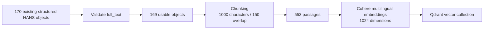

Each passage preserved its source title, URL and available metadata so later steps could support citations, deduplication, programme filtering and manual evaluation.

### 7.3 Why a separate vector collection was required

Embeddings created by different models are not directly comparable. The experimental PoC therefore created a separate Qdrant collection for the Cohere vectors rather than mixing them with vectors created by another embedding model.

At runtime, the topic query was embedded with the **same Cohere embedding model** used for the indexed passages.

---

## 8. Programme identity and programme-specific evidence

### 8.1 Programme catalogue

The programme catalogue acts as an identity/control resource before factual retrieval.

Typical fields/roles:

```text
official programme name
trusted aliases / abbreviations
degree level
canonical programme URL
programme match source / state
```

Programme states used by the Enhanced PoC logic include:

```text
confirmed
unknown
not provided
```

An unknown named programme must not silently fall back to a different programme or to generic programme-specific facts.

### 8.2 Official programme-page cache

A separate official-page evidence cache was introduced because the general canonical source collection did not reliably include every programme subpage.

Typical evidence topics include:

```text
application deadline
required documents
admission requirements
language requirements
language of instruction
study format
work experience
fees / programme-specific application information
```

The programme-page cache **supplements** the 170-object general knowledge basis; it does not replace it.

### 8.3 Source hierarchy principle

For programme-specific questions, the preferred order is conceptually:

```text
confirmed programme identity
-> direct official programme evidence where available
-> relevant general HANS evidence
-> applicability/source checks
-> generation
```

---

## 9. Enhanced PoC runtime request pipeline

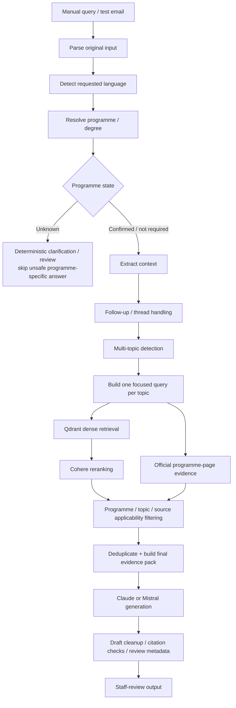

### 9.1 Input and context handling

The original student text is kept separate from internal programme metadata. Confirmed catalogue information can be added to retrieval queries without rewriting the original student message.

Limited thread context is used only to restore information missing from a clear follow-up. Explicit programme changes or uncertain follow-ups require new checks rather than blindly carrying forward previous context.

### 9.2 Multi-topic detection

The detector identifies multiple information needs in a single email. Supported topic families include, among others:

```text
application_deadline
required_documents
application_route
admission_requirements
language_proof
language_of_instruction
fees
study_format
work_experience
related administrative questions
```

One focused evidence query is created for each topic. This prevents a long compound email from becoming one blended vector query dominated by only one subject.

### 9.3 Retrieval and reranking

The Enhanced PoC v4 path uses:

```text
Cohere query embeddings
-> Qdrant dense retrieval
-> Cohere reranking
-> programme/topic filtering
-> direct official programme evidence insertion where applicable
-> smaller final evidence pack
```

The codebase contained a Reciprocal Rank Fusion wrapper, but local keyword search was not active in the evaluated freeze. Therefore the final experiment should not be described as a fully implemented dense + lexical hybrid-search system.

### 9.4 Evidence selection

Evidence selection considers:

- detected topic;
- confirmed programme and degree;
- source type;
- direct programme evidence availability;
- duplicate/near-duplicate results;
- source specificity;
- applicability to the administrative stage.

The goal is not to maximize the number of retrieved passages. The goal is to provide the generator with a **small, applicable and traceable evidence pack**.

### 9.5 Generation

The staff-email modes use the same orchestration path and evidence structure. The main intentional difference is the generation provider:

```text
Claude
Mistral
```

The generator receives:

```text
original email
requested language
programme context
detected topics
selected evidence
source identifiers / citation information
review-oriented instructions
```

The expected output is one coherent staff draft rather than a collection of disconnected QA answers.

### 9.6 Post-generation validation

After generation the system records or checks:

```text
citations
grounding fields
quality information
review reasons
response time
programme/topic metadata
```

These system-generated fields are diagnostic signals, not independent proof of correctness. Source applicability still requires checking whether the evidence belongs to the correct programme, degree, route, stage and topic.

---

## 10. Enhanced PoC operating modes

| Mode | Purpose | Context | Output |
|---|---|---|---|
| Baseline QA | Single-turn experimental QA | No previous turn | Direct answer + sources |
| Conversational QA | Follow-up/context experiment | Temporary session context | Context-aware answer + sources |
| Email Assistant – Claude | Staff-email generation | Email + programme + topics | Reviewable draft + sources/citations |
| Email Assistant – Mistral | Same email path with alternate generator | Email + programme + topics | Reviewable draft + sources/citations |

These are **experimental comparison modes**, not four proposed production interfaces.

---

## 11. Enhanced PoC Gmail/n8n integration

The Enhanced PoC email workflow demonstrated a complete draft-only integration path.

```mermaid
flowchart LR
    A["Labelled Gmail test email"] --> B["Gmail trigger"]
    B --> C["Retrieve complete message"]
    C --> D["Extract / normalise email text"]
    D --> E["Build HANS HTTP payload"]
    E --> F["Call HANS endpoint"]
    F --> G["Review routing"]
    G --> H["Create Gmail draft"]
    H --> I["Append Google Sheet evaluation log"]
    I --> J["Staff review + manual send"]
```

The workflow automated intake, payload preparation, backend processing, review routing, draft creation and evaluation logging. It did **not** send replies automatically.

---

# PART C – PRODUCTION-READINESS VERSION

## 12. Transition from the Enhanced PoC to the production-readiness version

The production-readiness version transfers the useful mechanisms validated in the Enhanced PoC into the self-hosted HANS environment while preserving the baseline source/retrieval direction.

Transferred functions include:

```text
programme resources
programme guards
intent / scope routing
multi-topic detection
follow-up classification
conflict handling
evidence filtering
citation logic
review logic
staff-email endpoint
draft-only behaviour
```

This is an architectural adaptation rather than a line-by-line copy of the Enhanced PoC because the baseline copy and the experimental PoC use different data structures, service boundaries and infrastructure components.

---

## 13. HTW-hosted Qwen model path

The self-hosted transfer tested generation using the HTW-hosted service:

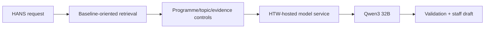

### 13.1 What this proved

The focused server tests showed that selected Enhanced PoC mechanisms could operate in the self-hosted baseline-oriented environment, including later regression fixes for unknown-programme handling and topic detection.

### 13.2 What it did not prove

It did not establish complete production readiness. Recorded generation time through the shared Qwen3 32B service was slower, and a small focused test set is not a full infrastructure benchmark.

For production readiness, the HTW path still requires stable service availability, access control, monitoring, operational ownership and performance validation.

---

## 14. Production-readiness workflow objective

The production-readiness version connects a stable HANS backend to a repeatable institutional email workflow while preserving draft-only human review. The generation layer is kept provider-independent so that the approved self-hosted model can be changed without changing the Apache Hop workflow contract.

The main architecture is:

```text
mailbox
-> Apache Hop orchestration
-> authenticated HANS API
-> programme/topic/retrieval/evidence controls
-> selected self-hosted generation model
-> validation/review metadata
-> Apache Hop response handling
-> Gmail draft
-> staff review/manual send
```

---

## 15. Current local Mac / Ollama model path

A second self-hosted model path has been established using a shared Mac test server.

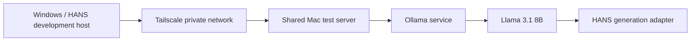

Current tested model state:

```text
environment         = development
generation_provider = htw_ollama
generation_model    = llama3.1:8b
embedding_model     = BAAI/bge-base-en-v1.5
database            = operational
automatic_send      = false
```

The provider name `htw_ollama` is an application configuration identifier. It should not by itself be interpreted as proof that the current Llama 3.1 8B process is physically hosted on a permanent HTW production server.

### 15.1 Why the Mac path exists

It proves that HANS can use a self-hosted/open-weight generation model through the same service boundary without changing the Apache Hop workflow.

### 15.2 Operational limitation

The current shared MacBook is a development/test host. A permanent Mac Mini or approved HTW server is preferable for a long-lived pilot because the current path depends on the host being powered, connected, reachable through Tailscale and running Ollama.

---

## 16. Generation-provider abstraction

HANS should remain model-independent at the workflow boundary.

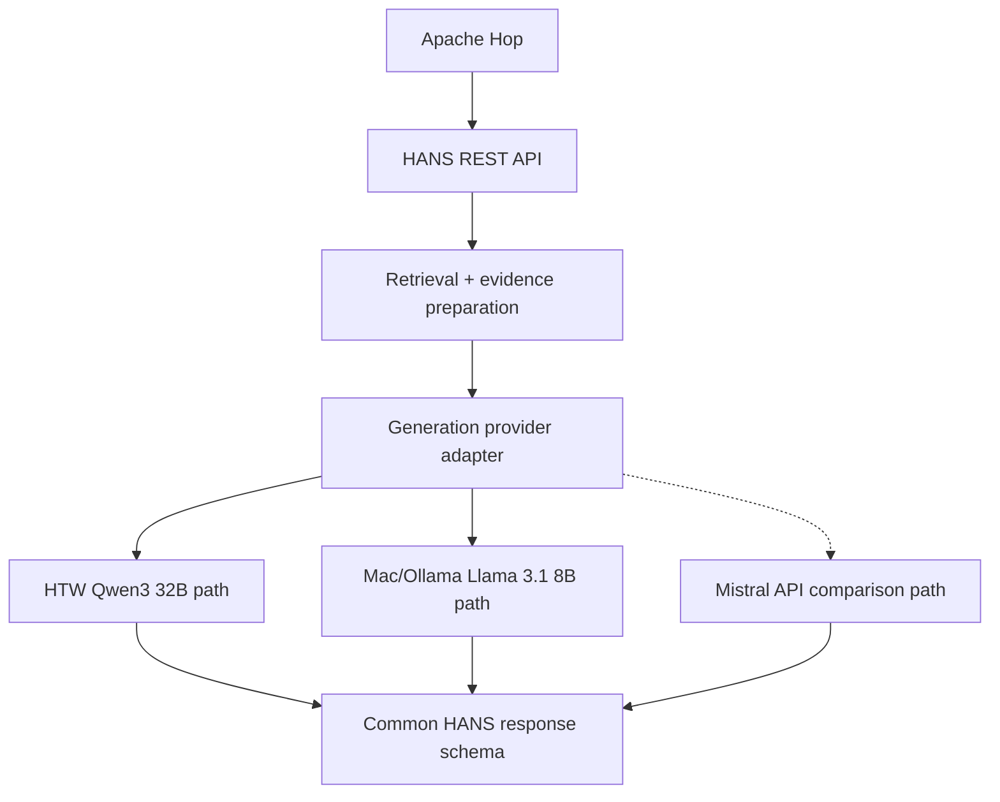

The external Mistral path is a **comparison/experimental option**, not the preferred self-hosted production path.

---

## 17. Current retrieval stack

The current development health output confirms:

```text
Embedding model: BAAI/bge-base-en-v1.5
Dimensions:      768
Database:        PostgreSQL + pgvector
```

### 17.1 Why BGE is retained

The current canonical knowledge corpus is English. The monolingual `BAAI/bge-base-en-v1.5` model is therefore aligned with the baseline's final retrieval direction and avoids changing the embedding model without evidence that a multilingual replacement would improve this English corpus.

Any future switch to a multilingual knowledge base should be treated as a new retrieval experiment requiring:

- re-embedding of the corpus;
- score/threshold recalibration;
- matched retrieval testing;
- regression testing of final drafts.

### 17.2 Current retrieval flow

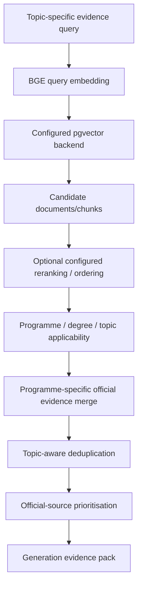

### 17.3 Reranking status in the current branch

The current codebase contains a cross-encoder reranking option (`cross-encoder/ms-marco-MiniLM-L-6-v2`) in the retrieval path used during some current tests. This should be treated as a **configurable component under evaluation**, not as a permanent architectural requirement.

The baseline evidence showed that cross-encoder reranking can hurt retrieval on a narrow institutional corpus. Therefore the production pilot should compare the configured reranked path against a calibrated BGE-only/document-merging path before fixing the final choice.

---

## 18. Current source architecture

The production-readiness implementation separates source responsibilities instead of treating every HTW page as interchangeable.

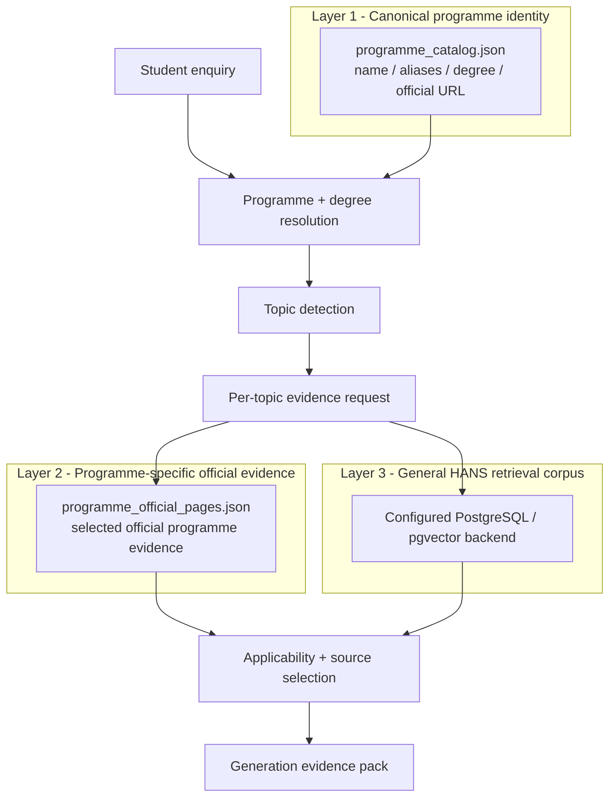

### 18.1 Layer 1 – programme identity

The catalogue should answer identity questions such as:

```text
What programme did the student name?
Is it an HTW programme?
What is the degree level?
Which aliases are trusted?
What is the official programme URL?
```

It should **not** be used as a permanent hard-coded store for changing facts such as deadlines, fees or English-test thresholds.

### 18.2 Layer 2 – programme-specific evidence

The programme-page cache supplies direct source evidence where a general HTW source is too broad. Evidence is selected by **programme + topic**, not merely by URL.

This is important because one programme page may contain several independent factual sections. Two snippets from the same URL may both be necessary if they support different requested topics.

### 18.3 Layer 3 – general retrieval corpus

The configured PostgreSQL/pgvector backend supplies general HTW and cross-programme information. Its candidate results are not accepted solely because they are semantically similar; they are subsequently checked for programme, degree, route, topic and administrative-stage applicability.

---

## 19. Source-count reconciliation and backend caution

Several source counts appear in project history because they describe different layers. They must not be mixed.

| Source/index layer | Count | Meaning |
|---|---:|---|
| Canonical HANS source preparation | **170 objects** | Curated baseline source layer built from 324 raw pages |
| Documented baseline index | **~930 chunks** | ~800/150 chunking of the 170 canonical objects in the documented baseline architecture |
| Enhanced PoC experimental index | **169 usable objects / 553 passages** | 1,000/150 Cohere + Qdrant Enhanced PoC stack |
| Active `legacy_public` store at the last explicit backend audit | **196 documents / 339 web chunks** | Database table counts for the currently configured baseline-oriented backend at the last explicit audit; not the canonical-object count |
| Fresh August V2 candidate | **139 documents / 749 chunks** | Re-scraped/reclassified candidate source store; not automatically active |

### 19.1 Important interpretation

The **170 objects remain the canonical source-design foundation**. The current runtime database may contain a different number of rows because indexing/migration representations are not the same thing as canonical object count.

Therefore, before a test report or client presentation states what source backend is active, check the configured retrieval backend for that run.

---

## 20. Fresh V2 source-refresh experiment

The August V2 work is a controlled source-refresh experiment within the production-readiness work. It must not replace the baseline retrieval source automatically; activation requires source audit, direct retrieval checks and regression testing.

### 20.1 V2 pipeline


### 20.2 Raw crawl traceability

The fresh crawler records information such as:

```text
page ID
URL
HTTP status
content type
raw HTML snapshot path
title
scraped_at timestamp
```

The raw HTML snapshot remains separate from the manifest so a later object can be traced back to the exact captured source page.

### 20.3 Classification and object build

The V2 workflow intentionally prevents every scraped page from becoming retrieval-ready content. Pages can remain `needs_review` until they are safely typed.

Accepted pages are converted to structured JSON objects containing fields such as:

```text
page_id
object_id
object_type
url
title
classification_confidence
classification_notes
source_html_path
scraped_at / last_scraped
last_processed
content.full_text
```

### 20.4 V2 migration result

The controlled V2 migration produced:

```text
139 documents
749 chunks
768-dimensional BGE embeddings
```

The V2 store remains separately switchable so retrieval changes can be tested and rolled back without silently replacing the stable backend.

---

# PART D – CURRENT HANS RUNTIME LOGIC

## 21. Email-processing service flow

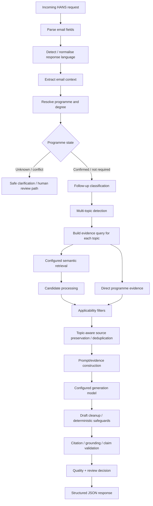

---

## 22. Programme resolution rules

Current programme handling follows a conservative order:

```text
1. Current email body is authoritative when it explicitly names a programme.
2. Subject is fallback/context, not stronger evidence than an explicit body reference.
3. Explicit Bachelor/Master wording must not be overwritten by an incompatible catalogue hint.
4. Subject/body mismatch is recorded rather than silently resolved.
5. An unknown named programme must not silently map to the nearest known programme.
```

For an unknown programme, the safe behaviour is to produce a clarification/review response rather than retrieve generic programme facts and present them as applicable.

---

## 23. Multi-topic processing

The current service detects a set of topics rather than one dominant intent.

Examples:

```text
application_deadline
required_documents
language_of_instruction
english_language_requirements
study_format
application_route
admission_requirements
application_before_graduation
fees
work_experience
german_language_requirements
```

Each topic receives its own base query and then an enriched evidence query using available programme/degree/context information.

This makes topic coverage observable: if a requested topic is absent from the detected-topic list, the retrieval stage cannot recover it later.

---

## 24. Follow-up and thread context

Thread memory is intentionally limited.

It is useful when a later email contains wording such as:

```text
Is that also required?
What about the deadline?
Does the same apply to me?
```

but does not repeat a programme already established in the thread.

Thread context must not become permanent truth. A new programme name, a topic switch, an unclear clarification or unrelated new question requires fresh interpretation.

---

## 25. Applicability filtering and evidence identity

A core current rule is that **semantic relevance is not administrative applicability**.

A candidate source can be rejected or deprioritised when it refers to:

- another programme;
- another degree level;
- a different application route;
- a special applicant category;
- enrolment rather than application;
- an outdated or too-general rule;
- a topic not asked in the current email.

The current evidence logic also distinguishes:

```text
retrieval duplicate
vs.
valid second topic-specific snippet from the same URL
```

Two pieces of evidence from one official page may both be necessary if they support different requested topics. Deduplication must therefore operate on evidence identity, not URL alone.

---

## 26. Deterministic safeguards

Not every safety rule is semantic or model-based.

Current safeguards include or are being tested for:

```text
unknown-programme stop
programme/degree conflict handling
application-stage source-gap handling
study-format evidence checks
unasked-topic/advice cleanup
citation/claim support checks
pending-final-result procedural safeguards
mandatory staff review
```

A lexical/rule-based safeguard may require morphology-aware patterns. For example, semantic retrieval may understand `wait` and `waiting` as related, while a deterministic cleanup rule still needs a pattern that covers the relevant grammatical forms.

---

# PART E – APACHE HOP EMAIL ORCHESTRATION

## 27. Apache Hop responsibility boundary

Apache Hop is the orchestration layer. It should not duplicate HANS RAG logic.

### Apache Hop owns

```text
mailbox read/input
field normalisation
email metadata creation
initial HANS relevance routing
HANS request construction
integration configuration / API secret loading
HTTP API call
response parsing
audit result persistence
draft eligibility branch
Gmail draft payload construction
Gmail draft creation
future scheduling/runtime orchestration
```

### HANS owns

```text
programme and degree interpretation
follow-up classification
topic detection
retrieval query construction
source retrieval
official programme evidence
applicability filtering
prompt construction
generation
citations / validation
quality and review metadata
```

---

## 28. Current Apache Hop pipeline – exact transform flow

```mermaid
flowchart LR
    A["01 - Read Gmail Test Emails"] --> B["01B - Normalize Gmail Fields"]
    B --> C["01C - Add HANS Email Metadata"]
    C --> D["02 - Determine HANS Relevance"]
    D --> E{"03 - Relevant for HANS?"}

    E -->|No| F["04A - Skipped Email"]
    F --> G["05A - Save Skipped Emails"]

    E -->|Yes| H["04B - Load HANS Configuration"]
    H --> I["05 - Build HANS Request"]
    I --> J["06 - Call HANS Draft API"]
    J --> K["06A - Remove Secret"]
    K --> L["07 - Raw HANS Response"]
    L --> M["08 - Parse HANS Response"]

    M --> N["09 - Save HANS Results"]
    M --> O{"10 - Draft Eligible?"}
    O -->|No| P["10A - No Gmail Draft"]
    O -->|Yes| Q["10B - Draft Ready"]
    Q --> R["11 - Prepare Gmail Draft Payload"]
    R --> S["12 - Create Gmail Draft"]
    S --> T["Staff review"]
    T --> U["Manual send"]
```

### 28.1 Transform-by-transform explanation

**01 – Read Gmail Test Emails**
Reads the controlled test mailbox/input. In the current PoC this is a polling/read action when the pipeline runs; it is not yet a permanent event-driven Gmail trigger.

**01B – Normalize Gmail Fields**
Maps Gmail-specific input fields to a stable internal structure so downstream transforms are not tightly coupled to one connector response shape.

**01C – Add HANS Email Metadata**
Adds traceability fields such as email/thread identifiers and other request context needed by the backend and audit logs.

**02 – Determine HANS Relevance**
Applies the upstream HANS-scope filter. This is a workflow routing decision and is separate from HANS multi-topic detection.

**03 – Relevant for HANS?**
Branches the workflow into HANS and non-HANS paths.

**04A / 05A – Skipped Email / Save Skipped Emails**
Ensures out-of-scope messages are not sent to HANS while retaining routing evidence for testing/audit where required.

**04B – Load HANS Configuration**
Loads the HANS service configuration from Apache Hop configuration/system variables rather than hardcoding secrets in pipeline transforms.

Typical variables include:

```text
HANS_API_URL
HANS_INTERNAL_API_KEY
```

Apache Hop does not automatically inherit the Python application's `.env`; the integration variables must be supplied through the Hop runtime/configuration environment.

**05 – Build HANS Request**
Creates the JSON request expected by the HANS draft endpoint.

**06 – Call HANS Draft API**
Performs the authenticated HTTP request.

**06A – Remove Secret**
Removes the integration secret from the active row after the HTTP call so it is not unnecessarily propagated into later transforms or result files.

**07 / 08 – Raw HANS Response / Parse HANS Response**
Retains the backend response and extracts the fields required for audit output and the mailbox-draft decision.

**09 – Save HANS Results**
Writes test/audit information independently of whether a Gmail draft is eventually created.

**10 – Draft Eligible?**
Acts as the final workflow-side gate before a mailbox draft action.

**10A – No Gmail Draft**
Stops draft creation when the HANS response or workflow policy says a draft should not be created.

**10B / 11 / 12 – Draft Ready / Prepare Gmail Draft Payload / Create Gmail Draft**
Creates the Gmail draft. It does not send the message.

---

## 29. HANS relevance routing

The Hop relevance filter should be intentionally simple and auditable. It is not responsible for making final administrative decisions.

Conceptually the routing states for an operational version should be:

```text
HANS
NOT_HANS
REVIEW
```

A programme name that cannot be confirmed is not automatically `NOT_HANS`; it can still be a legitimate HTW enquiry that requires HANS to produce a safe clarification/review result.

Out-of-scope categories include cases requiring direct administrative-system access, binding admission decisions, personal legal/visa advice, health/crisis handling, unrelated institutions and other topics outside the defined HANS support scope.

---

# PART F – API CONTRACT AND SERVICE CONFIGURATION

## 30. HANS API endpoints

### Health

```text
GET /health
```

Expected operational fields include:

```text
status
service
environment
generation_provider
generation_model
embedding_model
database
automatic_send
```

### Draft endpoint

```text
POST /v1/drafts
```

Legacy compatibility may remain through:

```text
POST /email
```

### Authentication

```text
X-HANS-API-Key: <integration-key>
```

---

## 31. Typical request schema

```json
{
  "email_text": "Synthetic student enquiry",
  "student_email": "test.student@example.invalid",
  "subject": "Application question",
  "thread_id": "TEST-THREAD-001",
  "email_id": "TEST-EMAIL-001",
  "language": "en",
  "top_k": 6
}
```

Important principles:

- `email_text` is the authoritative current message content for programme/topic interpretation;
- `thread_id` supports controlled follow-up context;
- `email_id` supports traceability and later idempotency protection;
- `language` can be explicitly supplied or derived depending on the caller path;
- `top_k` is a retrieval parameter, not a quality guarantee.

---

## 32. Important response fields

The structured HANS response contains or may contain:

```text
is_followup
followup_type
flagged_for_human
thread_id
email_id
email_context
detected_topics
staff_draft
citations
sources
validation
quality
conflicts
timing
automatic_send
```

### 32.1 Why the structured response matters

Apache Hop should not infer quality from free-text draft wording. It should rely on explicit structured fields for workflow decisions.

The response contract also keeps model selection inside HANS: switching from Llama to Qwen should not require redesigning the Hop pipeline.

---

# PART G – LOGGING, TESTING AND QUALITY CONTROL

## 33. Logging model

A production-readiness run should preserve enough information to reproduce a failure without storing unnecessary personal data.

Recommended technical fields include:

```text
run/request ID
email/test ID
thread ID
backend / endpoint
provider + model
embedding model
retrieval backend
programme state
programme match source
detected topic IDs
retrieved source IDs/URLs
review flag/reason
validation fields
timing fields
error state
```

Real student personal data should not be copied into general development logs unless operationally necessary and approved.

---

## 34. Current regression focus

The September quality branch/checkpoints cover focused behaviours including:

- body-first programme resolution;
- degree-aware evidence filtering;
- unknown-programme safe handling;
- language-of-instruction topic detection;
- multi-topic coverage;
- study-format evidence correctness;
- removal of unasked advice;
- preservation of topic-specific evidence from the same URL;
- application-stage / pending-final-result safeguards;
- citation/claim support;
- structured and temporal/deadline correctness.

### 34.1 Change-control method

The current development method is:

```text
1. reproduce one failure
2. inspect programme/topic/retrieval/evidence state
3. change one behaviour
4. run focused regression
5. rerun main regression cases
6. inspect sources + draft manually
7. preserve a Git checkpoint/tag
```

This prevents unrelated changes from being combined into one difficult-to-debug patch.

---

## 35. Retrieval/source audit principle

When an answer is wrong, the failure should be located before modifying the LLM.

The audit sequence is:

```mermaid
flowchart LR
    A["Incorrect / incomplete draft"] --> B["Was topic detected?"]
    B --> C["Was programme/degree resolved correctly?"]
    C --> D["Was correct source present in corpus/cache?"]
    D --> E["Was source retrieved?"]
    E --> F["Was it removed during reranking/filtering/deduplication?"]
    F --> G["Did prompt include it?"]
    G --> H["Did generator use it correctly?"]
    H --> I["Did validation catch unsupported claims?"]
```

This separation is critical because improving the generation model cannot fix a source that was never retrieved or an upstream topic that was never detected.

---

## 36. Token and performance measurement framework

The requested measurement framework should record, where available:

```text
request/test ID
provider/model
input/prompt tokens
output tokens
total tokens
retrieval time
reranking time, if enabled
generation time
total request time
source count
detected-topic count
review/quality result
cloud cost estimate for approved comparison runs
```

For Ollama-based models, timing/token statistics should be captured from the endpoint when exposed.

Model comparisons should use the **same frozen test set and evidence policy**. Otherwise latency/quality differences may actually be caused by retrieval changes rather than the model.

---

# PART H – SECURITY, PRIVACY AND OPERATIONAL HARDENING

## 37. Secrets boundary

Apache Hop should know only what it needs to call HANS.

It should not require direct access to:

```text
PostgreSQL credentials
pgvector internals
embedding-model configuration
reranker configuration
Mistral secret
Ollama internal configuration
prompt implementation
source-maintenance credentials
```

Do not commit:

```text
.env
API keys
mailbox credentials
production DB credentials
real student emails
personal-data runtime logs
```

---

## 38. Gmail OAuth status

The current Gmail OAuth setup is a testing configuration. This is acceptable for development but not sufficient for a long-running operational service because re-authorization may be required.

The pilot requires a stable, HTW-approved mailbox/OAuth configuration with defined ownership and revocation procedures.

---

## 39. Scheduling and persistent runtime

The current Apache Hop pipeline is end-to-end functional in development, but the Hop GUI/local engine is not the final operational runtime.

A practical target is scheduled polling:

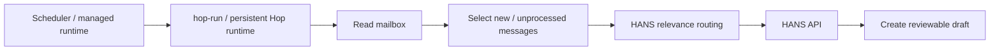

Possible operational scheduling approaches include:

```text
Windows Task Scheduler / cron invoking hop-run
persistent Hop Server + external orchestration
fixed run times during working hours
periodic polling every defined number of minutes
```

The current implementation should not be described as a true push/event-driven Gmail trigger unless such a trigger is explicitly implemented.

---

## 40. Duplicate / idempotency protection

Scheduled polling must not create multiple drafts for the same email.

Before regular automatic execution, the workflow should persist a stable processing identity based on fields such as:

```text
email_id
thread_id
processing status
HANS run/request ID
draft-created status
```

The exact storage mechanism is still an operational design decision, but duplicate prevention is a prerequisite for scheduled mailbox processing.

---

## 41. Error and retry behaviour

A production pilot needs explicit handling for:

```text
mailbox read failure
OAuth/authentication failure
HANS API unavailable
model endpoint unavailable / timeout
invalid JSON / response contract error
database/retrieval error
no applicable evidence
unknown programme
Gmail draft-creation failure
audit-log write failure
```

The current PoC proves the normal flow. The operational version must define which errors are retried, which are routed for manual review, and which stop the run.

---

## 42. Monitoring and operational ownership

The pilot should expose health for at least:

```text
Apache Hop runtime
mailbox authentication
HANS API
PostgreSQL / pgvector
active generation endpoint
source freshness
last successful workflow run
error count / failed requests
```

Operational ownership must also be named for:

```text
mailbox access
source maintenance
HANS backend
model host
workflow scheduler
secrets
incident response
```

---

# PART I – BIG-PICTURE ARCHITECTURE

## 43. Current production-readiness architecture

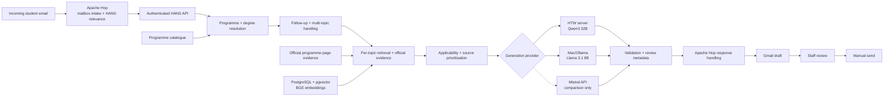

### 43.1 Architectural principles

1. **Human-in-the-loop:** no automatic final sending.
2. **No model training on incoming emails:** the system performs retrieval and inference; user correspondence is not used to update model weights.
3. **Official evidence first:** retrieval and generation should remain grounded in attributable HTW sources.
4. **Model independence at the workflow boundary:** Apache Hop calls HANS, not a specific LLM directly.
5. **Source applicability is separate from semantic relevance.**
6. **Programme identity is resolved before programme-specific factual generation.**
7. **Workflow, retrieval and model hosting remain separate components.**
8. **Source/index changes are testable and reversible.**

---

## 44. Target operational-pilot architecture

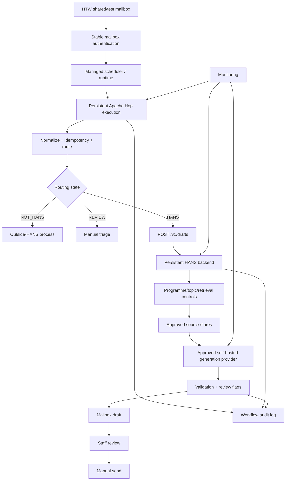

This is the target pilot architecture. It should not be described as fully deployed until the operational controls above are implemented and approved.

---

# PART J – RECOVERY AND HANDOVER

## 45. Minimum technical recovery checklist

When resuming the project on another machine or after a regression:

```text
1. Confirm intended Git branch/checkpoint.
2. Confirm working tree state.
3. Restore local environment/secrets without committing them.
4. Start/confirm PostgreSQL and required services.
5. Call GET /health.
6. Confirm generation provider/model.
7. Confirm embedding model.
8. Confirm configured retrieval backend separately.
9. Run programme-resolution tests.
10. Run multi-topic tests.
11. Run source-applicability/study-format/scope-cleanup regressions.
12. Run main end-to-end HANS regression.
13. Run Apache Hop Gmail integration.
14. Confirm automatic_send = false.
15. Confirm Gmail draft is created only through the intended branch.
```

---

## 46. Handover ownership split

### Workflow / Apache Hop maintainer needs

```text
HANS base URL
integration key through approved configuration
API request/response contract
mailbox configuration
routing policy
scheduler/runtime configuration
retry/error policy
audit-output location
idempotency mechanism
```

### HANS backend maintainer owns

```text
source refresh and audit
programme catalogue
programme-page evidence
retrieval/index configuration
applicability filtering
model-provider adapter
prompt construction
deterministic safeguards
validation/regression tests
API compatibility
```

### Infrastructure/model maintainer owns

```text
approved model host
Ollama/model service availability
network access
resource capacity
monitoring
model version control
security updates
```

---

## 47. Remaining implementation sequence

Recommended order before the operational pilot:

1. Finish the current source/retrieval/code audit.
2. Freeze a stable HANS quality checkpoint.
3. Run the complete regression suite.
4. Decide and document the pilot retrieval backend/source snapshot.
5. Compare current reranking vs calibrated BGE-only/document-merging retrieval on the same test set.
6. Reconfirm Apache Hop → HANS → Gmail against the frozen backend.
7. Add duplicate/idempotency protection.
8. Define retry/error/manual-review behaviour.
9. Select and configure the persistent Hop runtime/scheduler.
10. Stabilise mailbox/OAuth authentication.
11. Complete token/performance measurements.
12. Compare approved generation model options on the same frozen evidence/test set.
13. Define monitoring and operational ownership.
14. Complete privacy/security review before regular real-student-email processing.

---

## 48. Current system description for presentations and handover

The most accurate current description is:

> **HANS (Highly Automated Natural Language Support System) is a staff-facing retrieval-augmented email-drafting system that combines a curated HTW knowledge base, programme-aware and multi-topic evidence selection, self-hosted model options, Apache Hop workflow orchestration and mandatory human review. The current implementation is a working integration PoC being hardened toward an operational self-hosted pilot.**

The baseline copy provides the canonical source and retrieval foundation. The Enhanced PoC added and evaluated programme-aware, multi-topic, follow-up, source-control, validation and email-drafting mechanisms. The production-readiness version carries those useful mechanisms into the self-hosted direction, with the HTW-hosted Qwen3 32B and Mac/Ollama Llama 3.1 8B implementations as model paths and Apache Hop providing the current mailbox-to-Gmail-draft orchestration.

The system:

```text
does not train on incoming student emails
does not make binding administrative decisions
does not send replies automatically
requires staff verification before sending
```

---

## 49. Mermaid / VS Code viewing

Every architecture diagram is written as a fenced Mermaid block:

````markdown

````

For VS Code, use Markdown Preview (`Ctrl+Shift+V`) with Mermaid rendering enabled.

The diagrams use simple `flowchart LR`, `flowchart TD` and subgraph syntax with quoted node labels and `<br/>` line breaks for broad compatibility.

---

## 50. Document basis and interpretation rule

This handover consolidates the technical information from:

- the HANS baseline copy architecture and source-preparation documentation;
- the Enhanced PoC implementation, evaluation and Gmail/n8n integration;
- the HTW-server Qwen production-readiness path;
- the Mac/Ollama Llama production-readiness path;
- the Apache Hop → HANS → Gmail integration;
- the September source/retrieval audits, regression checkpoints and operational-hardening work.

**Interpretation rule:** every component is labelled by version and implementation status. Baseline-copy components, Enhanced-PoC experiments, current production-readiness components, controlled candidate paths and planned pilot controls must not be mixed when describing the live system. Source counts, vector stores, embedding models and generation models are therefore stated together with the version in which they apply.
